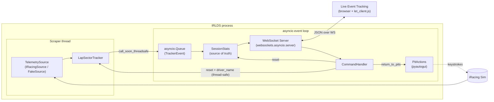
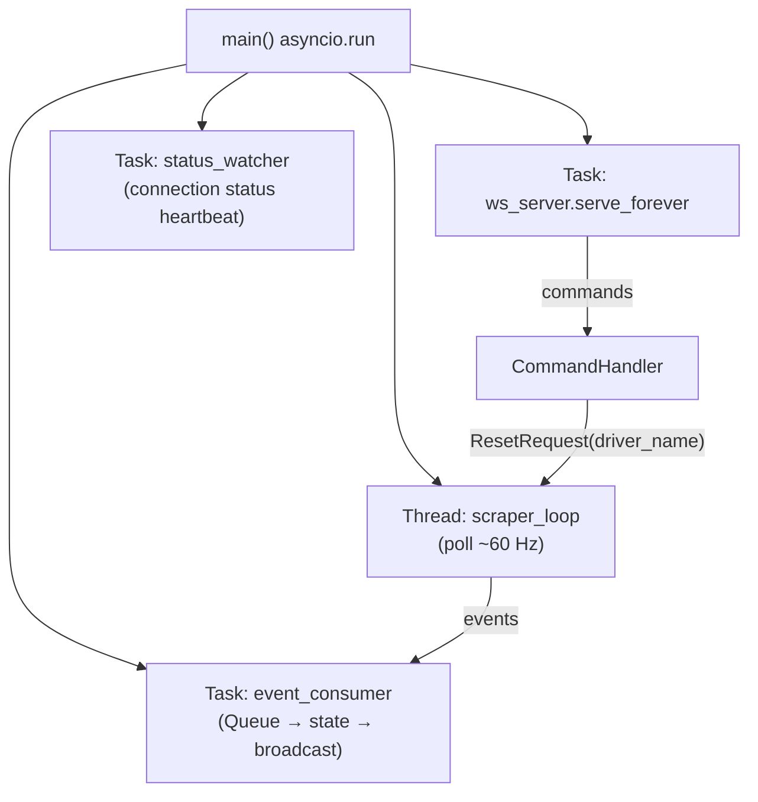
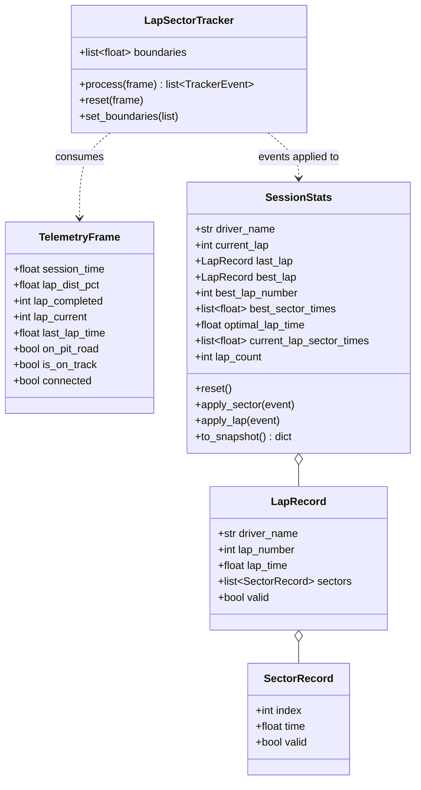
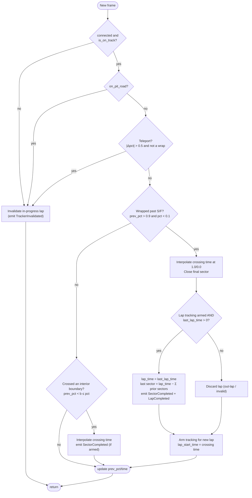
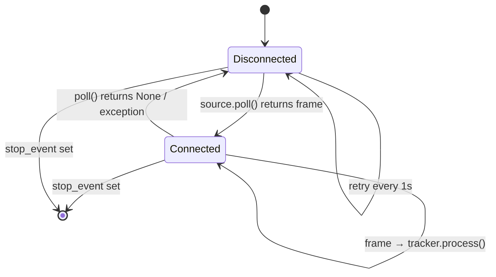
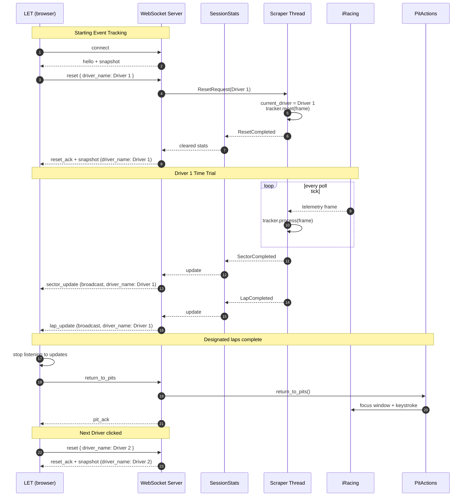
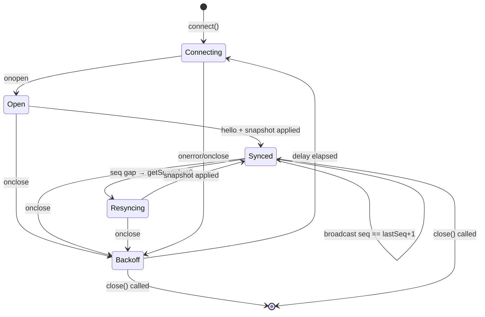
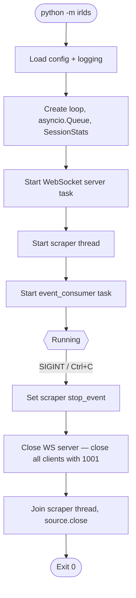

# iRacing Live Data Server (IRLDS) — Implementation Plan, Revision 4

> **Audience:** an AI coding agent doing the initial bulk implementation.
> **Source spec:** `ProjectOutline.md`. Where this plan adds detail, the outline remains the source of truth for *what*; this plan decides *how*.
> **Platform:** Windows only (iRacing + `pyautogui` keystrokes). Python 3.10+.
> **Basis:** Revision 4 = `IMPLEMENTATION_PLANv2` + selected ideas from `Plan9b` (client module, client-count reporting, limitations, troubleshooting) + hardening against unverified assumptions.

---

## 0. Revision Notes and Agent Rules

### 0.1 What changed from v2

| # | Change | Where |
|---|--------|-------|
| R1 | New **LET client module** (`client/let_client.js`) built on the v2 envelope, with reconnect and sequence-gap recovery | §9.7, Phase 7 |
| R2 | `clients` (connected client count) added to `hello` and `status`; connect/disconnect logged at INFO | §9.3, §8 |
| R3 | `seq` semantics tightened: broadcasts carry `seq`, direct replies carry `null`; `snapshot` carries `as_of_seq` | §9.2, §9.5 |
| R4 | **Verify-in-sim** items made explicit; pyirsdk version pinned; sector fallback documented | §7, §14.1 |
| R5 | Every open question now has a **default** the agent implements unless told otherwise | §16 |
| R6 | `return_to_pits` fallback documented (second key sequence), not promised | §11 |
| R7 | **Known limitations** and **troubleshooting** sections added | §17, §18 |
| R8 | **Agent rule: do not invent pyirsdk APIs** | §0.2 |

### 0.2 Rules for the implementing agent

1. **Do not invent pyirsdk APIs.** Use only the calls listed in §7. If something else seems needed, stop, leave a `# TODO(verify)` comment and a note in the README, and continue with the documented fallback.
2. **Do not assume iRacing publishes live sector times.** They are derived (§6).
3. **Never block the asyncio loop.** pyirsdk and pyautogui are synchronous (§3, §11).
4. **Tracker state is mutated only on the scraper thread; `SessionStats` and the client set only on the event loop.**
5. Implement the wire protocol in §9 **exactly** (type names, fields).
6. Each phase ends with green tests before starting the next.
7. Anything unverifiable without the sim goes on the manual checklist in the README, not into silent assumptions.

---

## 1. Goal Recap

A single Python process that:

1. Connects to a running iRacing sim (Test Drive / Time Trial) via `pyirsdk`.
2. Computes per-driver-session lap and sector statistics in real time.
3. Runs a WebSocket server (`websockets.asyncio.server`) that **pushes** updates unsolicited to every connected client (the LET web app) on each sector and lap completion.
4. Accepts commands from clients: **reset all session stats** (carrying the **driver name** supplied by LET), and **return driver to pits**.
5. Attributes all collected data to the current driver and includes the **driver name** in the data it broadcasts.
6. Ships a small reusable **browser client module** so LET (and the dev test page) consume the protocol the same way.

---

## 2. Key Design Decisions (read before coding)

| # | Decision | Rationale |
|---|----------|-----------|
| D1 | **Compute stats ourselves; do not rely on iRacing's `LapBestLap`/`LapBestLapTime` for reported values.** | iRacing's best-lap values persist across driver swaps. A "reset" must zero our stats, so we own the state. iRacing's `LapLastLapTime` is still used as the authoritative time of a just-completed lap. |
| D2 | **Lap numbers are relative to the last reset** (`1` = first counted lap after reset). | Each driver's Time Trial starts at lap 1. Store `baseline_lap_completed` at reset time. |
| D3 | **`pyirsdk` is synchronous → run it in a dedicated thread**, and hand events to the asyncio loop with `loop.call_soon_threadsafe` / `asyncio.Queue`. | Avoids blocking the WebSocket event loop. |
| D4 | **Sector times are derived from `LapDistPct` crossings** with linear interpolation on `SessionTime`. Sector boundaries come from session info YAML `SplitTimeInfo.Sectors[].SectorStartPct`. | iRacing does not publish live sector times directly. |
| D5 | **Last sector = `LapLastLapTime − sum(previous sectors)`** when the lap time is valid. | Guarantees sector times sum exactly to the lap time. |
| D6 | **Single in-memory `SessionStats` object is the source of truth**; the broadcaster only serialises it. | Simple, testable. New clients get a full `snapshot` on connect. |
| D7 | **A `TelemetrySource` protocol with two implementations:** `IRacingSource` (real) and `FakeSource` (scripted, for tests/dev without the sim). | Lets the agent build and test everything without iRacing running. |
| D8 | **All JSON messages use one envelope:** `{ "type", "seq", "ts", "data" }`. | Easy for the JS client to switch on `type`. |
| D9 | **Pit-return key binding is configurable** (`config.toml`), never hard-coded. | Default binding must be verified by the user against their iRacing controls. |
| D10 | **The LET supplies the driver name; it travels in the `reset` command** (`data.driver_name`). IRLDS stores it as the *current driver* and stamps it on every snapshot, sector update and lap update. | The outline sends `reset` at event start and on **Next Driver**, which is exactly when the driver changes. One command keeps name and stats reset atomic. |
| D11 | **Driver name is applied on the scraper thread, in the same tick as the tracker reset**, and stamped onto each `TrackerEvent` there. | A lap finishing right as a reset arrives is attributed to the driver who was current when the lap was recorded, never mixed with the next driver. |
| D12 | **`seq` numbers broadcasts only.** Direct replies (hello, acks, errors, pong, on-request snapshots) carry `seq: null`. Snapshots carry `as_of_seq`. | Lets a client detect missed broadcasts without false gaps caused by messages addressed to other clients. |
| D13 | **The browser client is a classic script (no ES module imports)** exposing `window.IRLDS.LetClient` and a CommonJS export when available. | Pages opened from `file://` cannot load ES modules; LET may be served either way. |

---

## 3. System Architecture



### Thread / Task Model



---

## 4. Repository Layout

```
iracing-live-data-server/
├── pyproject.toml
├── README.md
├── config.toml                    # runtime config (see §10)
├── src/
│   └── irlds/
│       ├── __init__.py
│       ├── __main__.py            # `python -m irlds`
│       ├── app.py                 # wiring + lifecycle (start/stop)
│       ├── config.py              # load/validate config.toml → dataclass
│       ├── logging_setup.py
│       ├── models.py              # dataclasses: LapRecord, SectorRecord, SessionStats, ...
│       ├── protocol.py            # message envelope, type constants, (de)serialisation
│       ├── events.py              # TrackerEvent types emitted by the tracker
│       ├── tracker.py             # LapSectorTracker (pure logic, no I/O)
│       ├── stats.py               # SessionStats update/reset/optimum logic
│       ├── sources/
│       │   ├── __init__.py
│       │   ├── base.py            # TelemetrySource Protocol + TelemetryFrame
│       │   ├── iracing.py         # pyirsdk-backed source
│       │   └── fake.py            # scripted source for tests/dev
│       ├── scraper.py             # thread: poll source → tracker → queue
│       ├── server.py              # WebSocket server, connection set, broadcast
│       ├── commands.py            # CommandHandler (reset, return_to_pits, ...)
│       └── pit_actions.py         # pyautogui wrapper
├── client/
│   └── let_client.js              # reusable browser client (classic script)  [NEW in rev 4]
├── tools/
│   └── test_client.html           # dev page; uses client/let_client.js
└── tests/
    ├── test_tracker.py
    ├── test_stats.py
    ├── test_protocol.py
    ├── test_server.py
    ├── test_commands.py
    └── js/
        └── let_client.test.js     # protocol-handling tests for the client (Node, no browser)
```

**Dependencies** (`pyproject.toml`):
`websockets>=13` (needed for `websockets.asyncio.server`), `pyirsdk` (**pin to the version actually tested**, e.g. `pyirsdk==<tested>`; record it in the README), `pyautogui`, `pygetwindow` (focus iRacing window), dev: `pytest`, `pytest-asyncio`. Use stdlib `tomllib` for config (Python 3.11+; add `tomli` fallback for 3.10). The JS client has **no** runtime dependencies; its tests use Node's built-in `node:test`.

---

## 5. Data Model (`models.py`)



Every `TrackerEvent` (`SectorCompleted`, `LapCompleted`, `ResetCompleted`) carries a `driver_name: str | None` stamped by the scraper thread (see D11). Use `@dataclass(slots=True)`. Times are floats in **seconds**; invalid/unknown = `None` (serialised as `null`). Lap/sector indices are **1-based** in the wire protocol, 0-based internally — document this in `protocol.py`.

**Optimums**
- `best_sector_times[i]` = min valid time seen for sector *i* since last reset.
- `optimal_lap_time` = sum of `best_sector_times` once every sector has a value, else `null`.

---

## 6. Core Logic: `LapSectorTracker` (`tracker.py`)

Pure, deterministic, no I/O — the most heavily unit-tested module.

### 6.1 Inputs / Outputs
- Input: `TelemetryFrame` per poll tick.
- Output: zero or more `TrackerEvent`s: `SectorCompleted`, `LapCompleted`, `TrackerInvalidated`.

### 6.2 Sector boundary setup
`boundaries = [s.SectorStartPct for s in SplitTimeInfo.Sectors]` (first is `0.0`). Sector *i* spans `boundaries[i]` → `boundaries[i+1]` (last sector → `1.0` wrap).

**Fallback (rev 4):** if session info has no `SplitTimeInfo.Sectors`, or it is malformed, or the first boundary is not `0.0`, log a WARNING once per session signature and fall back to a **single sector equal to the full lap** (`boundaries = [0.0]`). Clients must tolerate `sector_count == 1`. This is a supported mode, not an error.

### 6.3 Algorithm



**Interpolation:** `t = t_prev + (b − pct_prev) / (pct − pct_prev) * (t_now − t_prev)`; for the wrap case use `(1.0 − pct_prev) / ((1.0 − pct_prev) + pct)`.

**Edge cases the agent must handle and test:**
- Multiple boundaries crossed in a single tick (iterate boundaries in order).
- First lap after reset or after leaving the pits is an **out-lap** → not counted (`armed=False` until first clean S/F crossing). Controllable with `count_outlap` in config (default `false`).
- `last_lap_time <= 0` (iRacing reports −1 for invalid laps) → lap discarded, `valid=false`.
- Going backwards over the line (reverse) → treat as teleport.
- `reset(frame)`: clear internal state, set `baseline_lap_completed = frame.lap_completed`, disarm until next S/F crossing, store current `lap_dist_pct`.
- Session info changes (track change) → `set_boundaries()` then reset.
- Single-sector fallback (§6.2): the only sector closes at the S/F crossing and equals the lap time.

**Lap numbering:** `lap_number = frame.lap_completed − baseline_lap_completed` at the moment of lap completion (so the first counted lap is `1`).

---

## 7. iRacing Source (`sources/iracing.py`)

```python
class TelemetrySource(Protocol):
    def poll(self) -> TelemetryFrame | None: ...        # None = not connected
    def sector_boundaries(self) -> list[float] | None: ...
    def session_signature(self) -> str: ...             # changes on track/session change
    def close(self) -> None: ...
```

### 7.1 Permitted pyirsdk surface (agent rule 1)

Only these calls and keys may be used. Anything else requires a `TODO(verify)`.

| Purpose | Call / key |
|---|---|
| Create / start | `ir = irsdk.IRSDK()`, `ir.startup()` |
| Connection checks | `ir.is_initialized`, `ir.is_connected` |
| Consistent read of one tick | `ir.freeze_var_buffer_latest()` |
| Telemetry vars | `ir['SessionTime']`, `['LapDistPct']`, `['LapCompleted']`, `['Lap']`, `['LapLastLapTime']`, `['OnPitRoad']`, `['IsOnTrack']`, `['IsOnTrackCar']` |
| Session info | `ir['SplitTimeInfo']['Sectors']` (entries with `SectorStartPct`), `ir['DriverInfo']['DriverCarIdx']` if ever needed |
| Session-info change detection | `ir.last_session_info_update` |
| Teardown | `ir.shutdown()` |

**`IRacingSource` implementation notes**
- Call `startup()` only when not initialised; treat `is_initialized and is_connected` as "connected".
- Each poll: `freeze_var_buffer_latest()`, then read vars via `ir['VarName']`.
- Scalar vars refer to the player car; per-car arrays are **not** used in v1.
- Refresh session info only when `last_session_info_update` changes; recompute the `session_signature()` from track identity in session info and re-publish boundaries.
- On connection loss call `ir.shutdown()` and retry `ir.startup()` on following ticks.

### 7.2 Verify-in-sim items (put these in the README manual checklist)

1. `SplitTimeInfo.Sectors` is present and sensible for the tracks you will use (count, first boundary `0.0`).
2. `LapLastLapTime` becomes valid exactly when `LapCompleted` increments (check ordering within the same tick vs one tick later; adjust the tracker's "arm/validate" step if it lags by a frame).
3. `LapLastLapTime` reports `<= 0` for invalid laps in Time Trial as assumed.
4. `OnPitRoad` / `IsOnTrack` behaviour when returning to the pits in Test Drive / Time Trial.
5. Reported lap times match iRacing's HUD to the millisecond; sector sums equal lap time.
6. The pit hotkey in §10 matches the user's actual controls.

---

## 8. Scraper Thread (`scraper.py`)

- Loop at `poll_hz` (default 60) using a drift-corrected sleep.
- Connection state machine:



- Emit a `StatusChanged(connected: bool)` event on each transition.
- Reset handling: `CommandHandler` posts a `ResetRequest(driver_name)` to a thread-safe slot (e.g. `queue.SimpleQueue` or a lock-guarded variable; latest request wins). The scraper loop checks it **at the top of each tick**, sets `self.current_driver = request.driver_name`, calls `tracker.reset(latest_frame)`, and emits `ResetCompleted(driver_name)`. Every event the tracker emits afterwards is stamped with `self.current_driver`. This keeps all tracker mutation on one thread (no locks around tracker internals).
- If a reset arrives while iRacing is disconnected (no `latest_frame`), apply it to `SessionStats` and the current driver immediately and re-arm the tracker on the first frame after reconnect.
- Push events with `loop.call_soon_threadsafe(queue.put_nowait, event)`.
- Wrap each tick in try/except; log and continue. Never let the thread die silently.
- Log client connect/disconnect at INFO from the server side (§9.1); the scraper itself does not know about clients.

---

## 9. WebSocket Server & Protocol

### 9.1 Server (`server.py`)

```python
from websockets.asyncio.server import serve, ServerConnection
import websockets

CLIENTS: set[ServerConnection] = set()

async def handler(ws: ServerConnection):
    CLIENTS.add(ws)
    log.info("client connected: %s (total %d)", ws.remote_address, len(CLIENTS))
    broadcast_status()                       # clients count changed
    try:
        await ws.send(encode("hello", {...}, seq=None))
        await ws.send(encode("snapshot", stats.to_snapshot(as_of_seq=current_seq), seq=None))
        async for raw in ws:
            await commands.handle(ws, raw)
    finally:
        CLIENTS.discard(ws)
        log.info("client disconnected: %s (total %d)", ws.remote_address, len(CLIENTS))
        broadcast_status()

def broadcast(msg: str):
    websockets.broadcast(CLIENTS, msg)   # non-blocking, safe for slow clients
```

- Bind `host`/`port` from config (default `127.0.0.1:8765`; allow `0.0.0.0` opt-in).
- Origin check via the `origins=` parameter (config list; default allow any localhost origin). **Note for README:** a page opened from `file://` sends `Origin: null`, which a strict origin list rejects. Recommend serving LET and the test page from `http://localhost`, or explicitly allowing the null origin in config.
- Heartbeat: rely on `websockets` built-in ping (`ping_interval=20`).
- Malformed JSON / unknown `type` → reply with an `error` message; never close the connection.
- Any client may issue any command (default for open question §16-6).

### 9.2 Message Envelope

```json
{ "type": "lap_update", "seq": 42, "ts": 1738459201.123, "data": { } }
```

- `ts` is Unix epoch seconds (server clock).
- **`seq` (D12):** a server-wide monotonically increasing integer assigned to **broadcast** messages only (`sector_update`, `lap_update`, `status`, and the `snapshot` that follows a reset). **Direct replies** (`hello`, on-connect or on-request `snapshot`, `reset_ack`, `pit_ack`, `pong`, `error`) carry `"seq": null`.
- Optional `request_id` at envelope level is echoed in the corresponding direct reply for correlation.

### 9.3 Server → Client Messages

| `type` | Delivery | When | `data` |
|---|---|---|---|
| `hello` | direct | On connect | `{ server_version, sector_count, iracing_connected, driver_name, clients }` |
| `snapshot` | direct on connect / `get_snapshot`; **broadcast** after a reset | On connect, after reset, or on request | full `SessionStats` incl. `driver_name` and `as_of_seq` (see 9.5) |
| `sector_update` | broadcast | Every sector completed | `{ driver_name, sector, time, lap_number, current_lap_sectors, best_sector_times, optimal_lap_time }` |
| `lap_update` | broadcast | Every lap completed | `{ driver_name, lap_number, lap_time, valid, sectors, best_lap_time, best_lap_number, best_sector_times, optimal_lap_time, current_lap }` |
| `status` | broadcast | iRacing connect/disconnect, or client count change | `{ iracing_connected, clients }` |
| `reset_ack` | direct (to requester) | After a reset has been applied | `{ ok: true, driver_name }` (followed by the broadcast `snapshot`) |
| `pit_ack` | direct | After pit action attempted | `{ ok, detail }` |
| `pong` | direct | Reply to `ping` | `{}` |
| `error` | direct | Bad request / failures | `{ code, message, request_type? }` |

### 9.4 Client → Server Messages

| `type` | Meaning | `data` |
|---|---|---|
| `reset` | Reset all session stats and set the current driver (LET sends at event start and on **Next Driver**) | `{ driver_name: string }` |
| `return_to_pits` | Attempt to put the driver back in the pits (LET sends when designated laps complete) | `{}` |
| `get_snapshot` | Request a full snapshot (direct reply) | `{}` |
| `ping` | App-level ping | `{}` → server replies `pong` |

**`driver_name` rules (enforced in `commands.py`):**
- Required on `reset`; must be a string. Strip leading/trailing whitespace; reject empty or whitespace-only names and names over 64 characters.
- Rejected resets reply with `error` (`code: "invalid_driver_name"`) and **change nothing** (stats and current driver are untouched).
- Stored and echoed verbatim otherwise (Unicode allowed). It is a display label only and is never used in file paths, shell commands or log format strings.
- Before any `reset` has been received, `driver_name` is `null` in all outgoing messages. Updates produced while `driver_name` is `null` are still broadcast.

### 9.5 Snapshot Shape

```json
{
  "iracing_connected": true,
  "clients": 2,
  "as_of_seq": 41,
  "driver_name": "Jane Doe",
  "sector_count": 3,
  "current_lap": 3,
  "lap_count": 2,
  "last_lap":   { "driver_name": "Jane Doe", "lap_number": 2, "lap_time": 91.532, "sectors": [30.1, 31.2, 30.232], "valid": true },
  "best_lap":   { "driver_name": "Jane Doe", "lap_number": 1, "lap_time": 91.201, "sectors": [30.0, 31.1, 30.101], "valid": true },
  "best_lap_number": 1,
  "best_sector_times": [30.0, 31.1, 30.101],
  "optimal_lap_time": 91.201,
  "current_lap_sectors": [30.2]
}
```

`as_of_seq` is the `seq` of the most recent broadcast already reflected in this snapshot. A client applies a snapshot, then processes only broadcasts with `seq > as_of_seq`.

### 9.6 Event Flow



> The LET decides when to stop listening; the server keeps broadcasting regardless. The server must not assume any particular client behaviour.

### 9.7 Browser Client Module (`client/let_client.js`)  *(new in rev 4)*

A small, dependency-free class that wraps the WebSocket and the protocol so LET and `test_client.html` share one implementation. Classic script (D13): attaches `window.IRLDS = { LetClient }` and also `module.exports = { LetClient }` when `module` exists (used by Node tests).

**Public API**

```js
const client = new IRLDS.LetClient({
  url: "ws://127.0.0.1:8765",
  reconnect: { minMs: 500, maxMs: 10000, factor: 2, jitter: 0.2 },
  WebSocketImpl: WebSocket,           // injectable for tests
});

client.on("open" | "close" | "hello" | "snapshot" | "sector_update" | "lap_update"
          | "status" | "reset_ack" | "pit_ack" | "error" | "gap", handler);
client.connect();
client.close();                       // stops reconnecting
client.reset(driverName);             // sends { type:"reset", data:{ driver_name } }
client.returnToPits();                // sends { type:"return_to_pits", data:{} }
client.getSnapshot();
client.state;                         // { connected, iracingConnected, clients, driverName, snapshot, lastSeq }
```

**Behaviour rules**
1. Parse each message; ignore (and `console.warn`) anything that is not valid JSON or has no `type`.
2. Dispatch by `type`; unknown types are ignored, never thrown.
3. **Snapshot handling:** on `snapshot`, replace local state and set `lastSeq = data.as_of_seq` (broadcast snapshots after reset also carry `seq`; use `max`).
4. **Gap detection:** for any message with non-null `seq`: if `lastSeq !== null` and `seq > lastSeq + 1`, emit `"gap"` and call `getSnapshot()`; if `seq <= lastSeq` drop it as stale/duplicate; otherwise set `lastSeq = seq`.
5. **Reconnect:** on `close` (unless `client.close()` was called), retry with exponential backoff plus jitter; reset the delay after a successful `open`. After reconnecting, state is rebuilt from the `hello` + `snapshot` the server sends; set `lastSeq` from that snapshot.
6. **Commands while disconnected:** `reset`/`returnToPits` return `false` (and emit `"error"` with `code: "not_connected"`) rather than queueing, so LET never silently replays a stale `reset` to the wrong driver.
7. **Driver attribution:** the client never infers the driver; it displays `driver_name` from each message.
8. No DOM access inside `let_client.js`. UI code lives in the consumer (`test_client.html`, LET).



---

## 10. Config (`config.toml`)

```toml
[server]
host = "127.0.0.1"
port = 8765
allowed_origins = []          # empty = allow all localhost origins; add "null" to allow file:// pages

[scraper]
poll_hz = 60
count_outlap = false

[pit_actions]
enabled = true
window_title = "iRacing.com Simulator"
# VERIFY against the user's iRacing controls before relying on this.
key_sequence = [["alt", "r"]]   # list of steps; each step is a list of keys held together
fallback_key_sequence = []      # optional second attempt, empty = none (see §11)
pre_delay_ms = 150
failsafe = true                 # pyautogui failsafe (mouse to corner aborts)

[logging]
level = "INFO"
file = "irlds.log"
```

Optional environment overrides (`IRLDS_HOST`, `IRLDS_PORT`, `IRLDS_LOG_LEVEL`) may be supported in `config.py`; config file values are the default source of truth.

---

## 11. Pit Actions (`pit_actions.py`)

- `return_to_pits()` is **blocking** (pyautogui) → call via `await asyncio.to_thread(...)`.
- Steps: find window by title (`pygetwindow`) → `activate()` → short delay → send each step in `key_sequence` with `pyautogui.hotkey(*step)`.
- **Fallback (rev 4):** if `fallback_key_sequence` is non-empty and the primary attempt raised, or the window could not be focused and was found on retry, attempt the fallback once. Report which path ran in `detail` (`"primary"` / `"fallback"`). Do **not** implement any alternative mechanism beyond key sequences in v1 (no coordinate clicking, no SDK pit commands) — the SDK's pit command manages pit-stop service options and is not assumed to send the car to the pits.
- Return a `PitResult(ok: bool, detail: str)`; never raise to the WS handler. If the window is not found, `ok=false, detail="iRacing window not found"`.
- Guard with an `asyncio.Lock` so repeated commands cannot overlap.
- Honour `pit_actions.enabled = false` (reply `ok=false, detail="disabled"`).
- Note in code comments that `pyautogui` only works with the target window in the foreground and the desktop unlocked.
- Dev/test: `FakePitActions` records calls; inject via constructor.

---

## 12. Application Lifecycle (`app.py`)



- Start order matches the outline: **WebSocket Server first, then the iRacing Data Scraper**; stop both on shutdown.
- On Windows, `loop.add_signal_handler` is unsupported → catch `KeyboardInterrupt` around `asyncio.run` and trigger the same shutdown path.
- The WS server must start even if iRacing is not running (status = `iracing_connected: false`).

---

## 13. Implementation Phases (ordered work packages)

Each phase should end with passing tests before moving on.

### Phase 0 — Scaffolding
- [ ] Create layout from §4, `pyproject.toml` (with pinned `pyirsdk`), `README.md` stub.
- [ ] `config.py` with dataclasses + defaults + TOML loader.
- [ ] `logging_setup.py`.
- **Done when:** `python -m irlds --help` runs and config loads.

### Phase 1 — Models, Protocol, Stats
- [ ] `models.py`, `events.py`.
- [ ] `stats.py`: `SessionStats` (holds `driver_name`, cleared/replaced on `reset(driver_name)`) with `apply_sector`, `apply_lap`, `reset`, `to_snapshot(as_of_seq=...)`, optimum calculation.
- [ ] `protocol.py`: `encode(type, data, seq)` with `ts` (and optional `request_id` echo), `decode(raw)` with validation; broadcast sequence counter lives here or in `server.py`.
- **Done when:** unit tests cover best-lap selection, optimal lap, reset clearing everything and replacing the driver name, invalid laps ignored for bests, `driver_name` present in every snapshot/event payload, `seq: null` for direct replies and strictly increasing `seq` for broadcasts, and `as_of_seq` in snapshots.

### Phase 2 — Tracker (core logic)
- [ ] `sources/base.py` (`TelemetryFrame`, `TelemetrySource`).
- [ ] `tracker.py` per §6, including the single-sector fallback.
- [ ] `sources/fake.py`: generates frames for a synthetic car (configurable lap time, sector splits, optional pit entry / invalid lap / teleport / missing sector info).
- **Done when:** `test_tracker.py` passes scenarios: clean laps, multi-boundary tick, out-lap discard, invalid lap, pit entry mid-lap, teleport, reset mid-lap, sector sum == lap time, single-sector fallback.

### Phase 3 — Scraper & iRacing Source
- [ ] `sources/iracing.py` per §7 (only the permitted API surface).
- [ ] `scraper.py` thread per §8 (reset slot, status events, error isolation, reset-while-disconnected).
- **Done when:** with `FakeSource`, events arrive on the asyncio queue; with the real sim (manual, §7.2) `LapDistPct` crossings produce sensible sector times.

### Phase 4 — WebSocket Server & Commands
- [ ] `server.py` handler, client set, `broadcast`, client-count `status` broadcasts, INFO connect/disconnect logs.
- [ ] `commands.py`: `reset` (with `driver_name` validation per §9.4), `get_snapshot`, `ping`, `return_to_pits` (stub PitActions OK).
- [ ] `event_consumer` task: queue → `SessionStats` → `sector_update` / `lap_update` / `status` / `reset_ack` + `snapshot` broadcasts.
- **Done when:** `test_server.py` starts the server on an ephemeral port with `FakeSource`, connects `websockets` clients, and asserts:
  - hello/snapshot on connect (with `seq: null`, `as_of_seq` present, correct `clients`);
  - a second client connecting/disconnecting produces a `status` broadcast with the updated `clients` count;
  - sector/lap updates broadcast to **all** clients with strictly increasing `seq`;
  - reset with a name yields `reset_ack` + empty snapshot carrying that name;
  - reset with a missing/blank/oversized name yields `invalid_driver_name` and leaves state unchanged;
  - every `sector_update`/`lap_update` carries the driver set by the last reset (including across a second reset to a different driver);
  - bad JSON yields `error` without disconnect.

### Phase 5 — Pit Actions
- [ ] `pit_actions.py` per §11 with `FakePitActions` and the optional fallback sequence.
- [ ] Wire `return_to_pits` command → `pit_ack`.
- **Done when:** command tests pass with the fake (success, window-not-found, disabled, overlapping calls, fallback path); real path manually verified by the user.

### Phase 6 — App Wiring, Lifecycle, Dev Tools
- [ ] `app.py` + `__main__.py` per §12, with CLI flags `--config`, `--fake-source` (use `FakeSource` for demos), `--log-level`.
- [ ] `tools/test_client.html`: loads `client/let_client.js`, renders a small live table (driver, last lap, best lap, sectors, optimal, connection/client count), shows raw messages, and has a driver-name input plus **Reset**, **Return to pits** and **Get snapshot** buttons.
- [ ] README: setup, run, protocol summary, troubleshooting (§18), limitations (§17), manual verify checklist (§7.2), pinned pyirsdk version, open-question defaults (§16).
- **Done when:** `python -m irlds --fake-source` + `test_client.html` shows live updates and reset works end-to-end.

### Phase 7 — LET Client Module (new in rev 4)
- [ ] `client/let_client.js` per §9.7 (classic script, no dependencies, injectable `WebSocketImpl`).
- [ ] `tests/js/let_client.test.js` using `node:test` and a fake WebSocket: covers hello/snapshot handling, `seq` gap → `getSnapshot()`, stale/duplicate `seq` dropped, `as_of_seq` handling, reconnect backoff (fake timers), commands rejected while disconnected, unknown/invalid messages ignored.
- [ ] Refactor `test_client.html` so all protocol handling goes through the module (the page contains UI code only).
- **Done when:** Node tests pass, and the page works against both `--fake-source` and a killed-and-restarted server (client auto-reconnects and resyncs without a page reload).

---

## 14. Testing Strategy

| Layer | Approach |
|---|---|
| `tracker` | Pure unit tests with hand-built frame sequences; assert emitted events and times to ±1 ms. |
| `stats` | Unit tests on event application order and reset, including driver name replacement. |
| `protocol` | Round-trip encode/decode, invalid input rejection, `seq` rules. |
| `server` | `pytest-asyncio`, real `websockets` client against ephemeral port, `FakeSource`. |
| `commands` | Inject `FakePitActions` and a stub reset hook; cover `driver_name` validation and the reset-vs-in-flight-lap attribution case (D11). |
| `client` (JS) | `node --test` with a fake WebSocket; no browser needed. |
| Manual (needs sim) | §14.1 checklist. |

### 14.1 Manual checklist (README)
1. Run a few laps in Test Drive; compare reported lap times to the iRacing HUD.
2. Verify sector sums equal lap time and that sector count matches the track.
3. Verify `reset` between "drivers" zeroes stats and renames the driver.
4. Verify out-lap handling and an invalid lap (cut/off-track) behave per §16 defaults.
5. Verify the pit hotkey (and fallback, if configured).
6. Items 1–4 of §7.2 that concern pyirsdk timing and pit-road flags.

---

## 15. Non-Functional Requirements

- **Latency:** an update should be broadcast within ~50 ms of the sector/lap crossing (poll at 60 Hz).
- **Robustness:** iRacing may start/stop at any time; the server must stay up and recover automatically. Browser clients may reload or drop at any time and must resync from `hello` + `snapshot`.
- **Thread safety:** only the scraper thread touches the tracker; only the event loop touches `SessionStats` and `CLIENTS`.
- **No unsolicited stdout noise** — use `logging`.
- **Type hints everywhere**; run `ruff` and `mypy` clean if configured.

---

## 16. Open Questions — with Defaults the Agent Implements

Surface these to the user, but build to the defaults so work is never blocked.

| # | Question | **Default** | Code impact |
|---|---|---|---|
| 1 | Pit-return hotkey | `alt+r` (placeholder), configurable; optional fallback sequence empty | `config.toml` only |
| 2 | Count the out-lap? | **No** (`count_outlap = false`) | tracker arm logic |
| 3 | Invalid laps | Excluded from bests/optimums; still reported with `valid: false` | stats |
| 4 | Sector count | From `SplitTimeInfo`; single-sector fallback if missing | tracker, clients |
| 5 | Network exposure | Localhost only; `0.0.0.0` opt-in | config |
| 6 | Multiple clients | All receive broadcasts; **any** client may issue `reset` / `return_to_pits` | commands |
| 7 | Driver name | Free text, 1–64 chars after trim, no uniqueness check; **reject** `reset` when missing/blank | commands |
| 8 | Mid-run rename | Not supported in v1 (name changes only via `reset`); add `set_driver` later if needed | none now |
| 9 | LET served from `file://` | Not recommended; document `Origin: null` handling in README | config note |

---

## 17. Known Limitations

1. **Windows only.** `pyautogui`/`pygetwindow` need a desktop session; not for headless or locked machines.
2. **Pit action is best-effort.** It works only with iRacing in the foreground and the correct key binding.
3. **pyirsdk compatibility** depends on the pinned version and the installed iRacing build; verify with §7.2 after upgrades.
4. **Single server instance.** No clustering; one process owns the stats.
5. **Player car only.** Scalar telemetry refers to the player; no multi-car or spectator data in v1.
6. **Open WebSocket by default on localhost.** No authentication; if exposed beyond localhost, add auth/TLS (out of scope for v1).
7. **Browser origins:** strict origin lists can block `file://` pages (see §9.1).

---

## 18. Troubleshooting (for the README)

| Symptom | Check |
|---|---|
| `iracing_connected: false` forever | Is iRacing running and in a session? Does `pyirsdk` match your install? Start order does not matter. |
| Client can't connect | Is the server running (`netstat -an \| findstr 8765`)? Host/port in config? Firewall? Origin list (esp. `file://` → `Origin: null`)? |
| Sector times look wrong or only one sector | Track may lack `SplitTimeInfo`; check the WARNING log and §6.2 fallback. |
| Lap numbers don't restart | A `reset` must be sent (with a driver name); numbering is relative to the last reset. |
| `invalid_driver_name` error | Name empty, whitespace-only, not a string, or over 64 characters. |
| `pit_ack ok:false` "window not found" | Check `pit_actions.window_title`; iRacing must be running with a visible window. |
| `pit_ack ok:true` but nothing happens | Verify the key binding in iRacing controls; the window must be focused; desktop unlocked. |
| Client keeps reconnecting | Server down, port mismatch, or origin rejected; see server log. |

---

## 19. Definition of Done (initial bulk coding)

- [ ] All phases (0–7) complete; `pytest` and the JS `node --test` suite green.
- [ ] `python -m irlds` starts WS server first, then scraper, and shuts both down cleanly on Ctrl+C.
- [ ] Protocol in §9 implemented exactly (type names, fields, `seq` rules), including `driver_name` on `reset` and on every outgoing data message, and `clients` in `hello`/`status`.
- [ ] `client/let_client.js` implements §9.7; `test_client.html` uses it exclusively for protocol handling.
- [ ] `--fake-source` demo works with `tools/test_client.html`, including reconnect after a server restart.
- [ ] Only the pyirsdk calls in §7.1 are used; anything else is marked `TODO(verify)`.
- [ ] README documents setup, config, protocol, manual checklist (§7.2/§14.1), limitations (§17), troubleshooting (§18), and the open-question defaults (§16).
