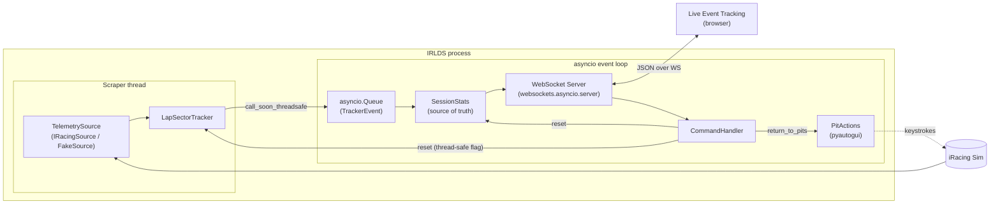
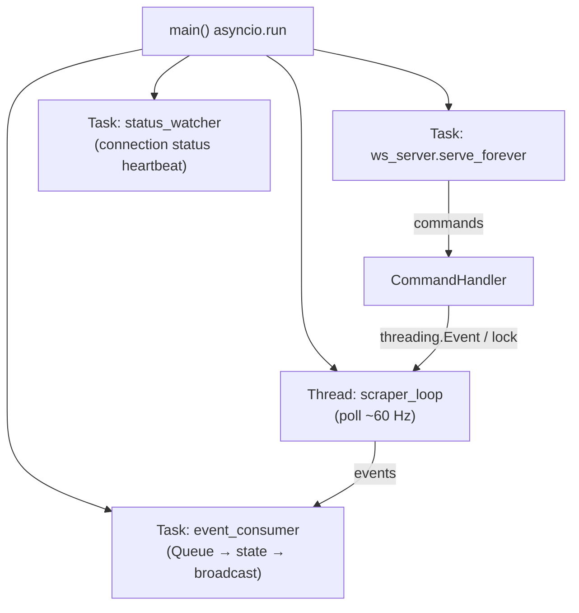
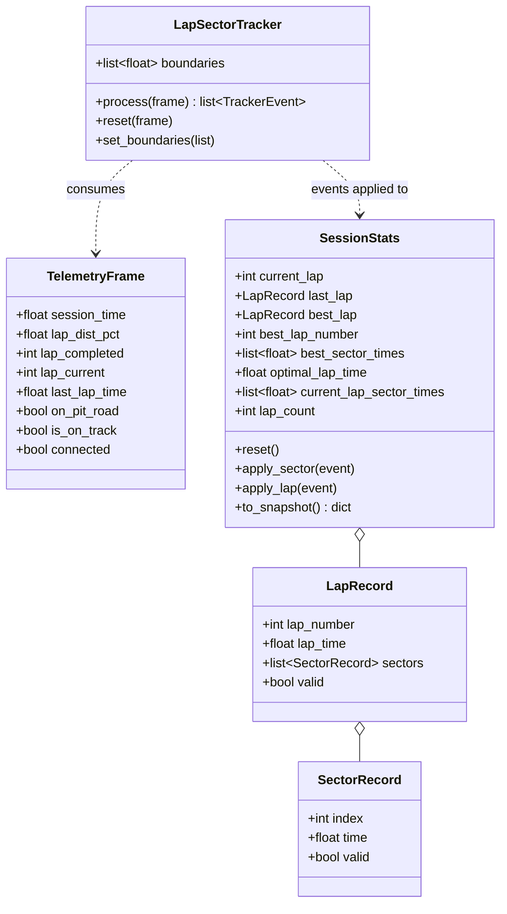
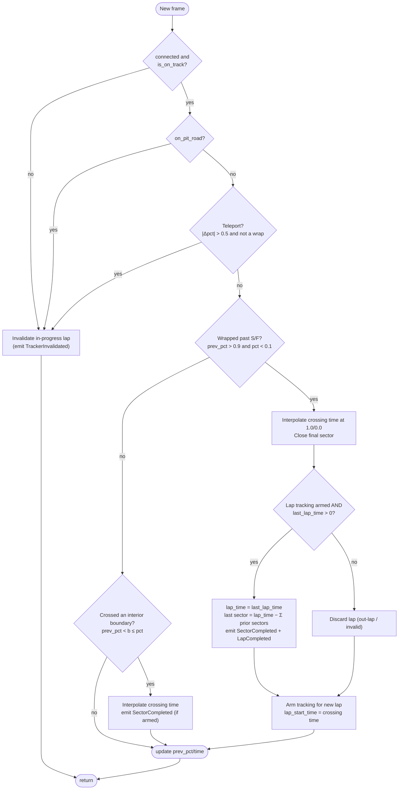
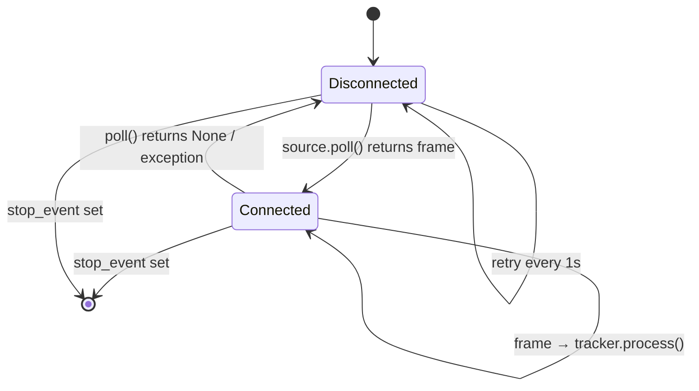
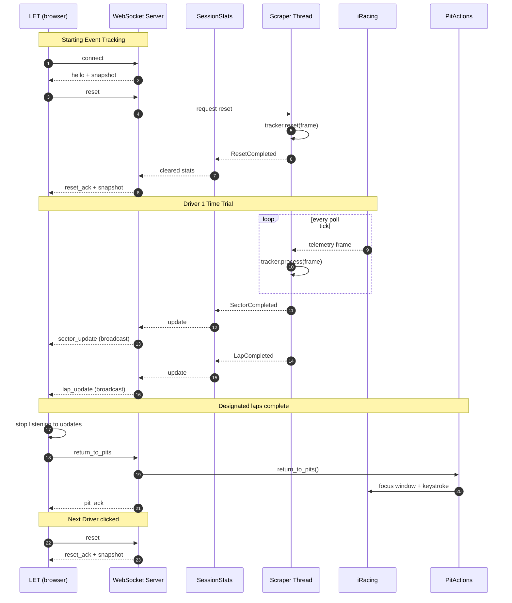
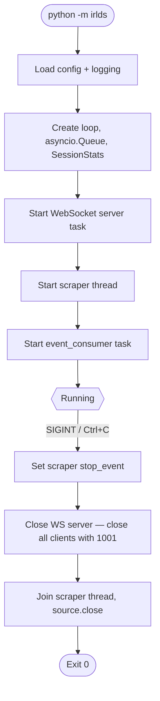

# iRacing Live Data Server (IRLDS) — Implementation Plan

> **Audience:** an AI coding agent doing the initial bulk implementation.
> **Source spec:** `ProjectOutline.md`. Where this plan adds detail, the outline remains the source of truth for *what*; this plan decides *how*.
> **Platform:** Windows only (iRacing + `pyautogui` keystrokes). Python 3.10+.

---

## 1. Goal Recap

A single Python process that:

1. Connects to a running iRacing sim (Test Drive / Time Trial) via `pyirsdk`.
2. Computes per-driver-session lap and sector statistics in real time.
3. Runs a WebSocket server (`websockets.asyncio.server`) that **pushes** updates unsolicited to every connected client (the LET web app) on each sector and lap completion.
4. Accepts commands from clients: **reset all session stats**, and **return driver to pits**.

---

## 2. Key Design Decisions (read before coding)

| # | Decision | Rationale |
|---|----------|-----------|
| D1 | **Compute stats ourselves; do not rely on iRacing's `LapBestLap`/`LapBestLapTime` for reported values.** | iRacing's best-lap values persist across driver swaps. A "reset" must zero our stats, so we own the state. iRacing's `LapLastLapTime` is still used as the authoritative time of a just-completed lap. |
| D2 | **Lap numbers are relative to the last reset** (`1` = first counted lap after reset). | Each driver's Time Trial starts at lap 1. Store `baseline_lap_completed` at reset time. |
| D3 | **`pyirsdk` is synchronous → run it in a dedicated thread**, and hand events to the asyncio loop with `loop.call_soon_threadsafe` / `asyncio.Queue`. | Avoids blocking the WebSocket event loop. |
| D4 | **Sector times are derived from `LapDistPct` crossings** with linear interpolation on `SessionTime`. Sector boundaries come from session info YAML `SplitTimeInfo.Sectors[].SectorStartPct`. | iRacing does not publish live sector times directly. |
| D5 | **Last sector = `LapLastLapTime − sum(previous sectors)`** when the lap time is valid. | Guarantees sector times sum exactly to the lap time. |
| D6 | **Single in-memory `SessionStats` object is the source of truth**; the broadcaster only serialises it. | Simple, testable. New clients get a full `snapshot` on connect. |
| D7 | **A `TelemetrySource` protocol with two implementations:** `IRacingSource` (real) and `FakeSource` (scripted, for tests/dev without the sim). | Lets the agent build and test everything without iRacing running. |
| D8 | **All JSON messages use one envelope:** `{ "type", "seq", "ts", "data" }`. | Easy for the JS client to switch on `type`. |
| D9 | **Pit-return key binding is configurable** (`config.toml`), never hard-coded. | Default binding must be verified by the user against their iRacing controls. |

---

## 3. System Architecture



### Thread / Task Model



---

## 4. Proposed Repository Layout

```
iracing-live-data-server/
├── pyproject.toml
├── README.md
├── config.toml                    # runtime config (see §10)
├── src/
│   └── irlds/
│       ├── __init__.py
│       ├── __main__.py            # `python -m irlds`
│       ├── app.py                 # wiring + lifecycle (start/stop)
│       ├── config.py              # load/validate config.toml → dataclass
│       ├── logging_setup.py
│       ├── models.py              # dataclasses: LapRecord, SectorRecord, SessionStats, ...
│       ├── protocol.py            # message envelope, type constants, (de)serialisation
│       ├── events.py              # TrackerEvent types emitted by the tracker
│       ├── tracker.py             # LapSectorTracker (pure logic, no I/O)
│       ├── stats.py               # SessionStats update/reset/optimum logic
│       ├── sources/
│       │   ├── __init__.py
│       │   ├── base.py            # TelemetrySource Protocol + TelemetryFrame
│       │   ├── iracing.py         # pyirsdk-backed source
│       │   └── fake.py            # scripted source for tests/dev
│       ├── scraper.py             # thread: poll source → tracker → queue
│       ├── server.py              # WebSocket server, connection set, broadcast
│       ├── commands.py            # CommandHandler (reset, return_to_pits, ...)
│       └── pit_actions.py         # pyautogui wrapper
├── tools/
│   └── test_client.html           # minimal browser page to watch the stream
└── tests/
    ├── test_tracker.py
    ├── test_stats.py
    ├── test_protocol.py
    ├── test_server.py
    └── test_commands.py
```

**Dependencies** (`pyproject.toml`):
`websockets>=13` (needed for `websockets.asyncio.server`), `pyirsdk`, `pyautogui`, `pygetwindow` (focus iRacing window), dev: `pytest`, `pytest-asyncio`. Use stdlib `tomllib` for config (Python 3.11+; add `tomli` fallback for 3.10).

---

## 5. Data Model (`models.py`)



Use `@dataclass(slots=True)`. Times are floats in **seconds**; invalid/unknown = `None` (serialised as `null`). Lap/sector indices are **1-based** in the wire protocol, 0-based internally — document this in `protocol.py`.

**Optimums**
- `best_sector_times[i]` = min valid time seen for sector *i* since last reset.
- `optimal_lap_time` = sum of `best_sector_times` once every sector has a value, else `null`.

---

## 6. Core Logic: `LapSectorTracker` (`tracker.py`)

Pure, deterministic, no I/O — the most heavily unit-tested module.

### 6.1 Inputs / Outputs
- Input: `TelemetryFrame` per poll tick.
- Output: zero or more `TrackerEvent`s: `SectorCompleted`, `LapCompleted`, `TrackerInvalidated`.

### 6.2 Sector boundary setup
`boundaries = [s.SectorStartPct for s in SplitTimeInfo.Sectors]` (first is `0.0`). Sector *i* spans `boundaries[i]` → `boundaries[i+1]` (last sector → `1.0` wrap). If session info has no sectors, fall back to a single sector (= full lap).

### 6.3 Algorithm



**Interpolation:** `t = t_prev + (b − pct_prev) / (pct − pct_prev) * (t_now − t_prev)`; for the wrap case use `(1.0 − pct_prev) / ((1.0 − pct_prev) + pct)`.

**Edge cases the agent must handle and test:**
- Multiple boundaries crossed in a single tick (iterate boundaries in order).
- First lap after reset or after leaving the pits is an **out-lap** → not counted (`armed=False` until first clean S/F crossing). Make this controllable with `count_outlap` in config (default `false`).
- `last_lap_time <= 0` (iRacing reports −1 for invalid laps) → lap discarded, `valid=false`.
- Going backwards over the line (reverse) → treat as teleport.
- `reset(frame)`: clear internal state, set `baseline_lap_completed = frame.lap_completed`, disarm until next S/F crossing, store current `lap_dist_pct`.
- Session info changes (track change) → `set_boundaries()` then reset.

**Lap numbering:** `lap_number = frame.lap_completed − baseline_lap_completed` at the moment of lap completion (so the first counted lap is `1`).

---

## 7. iRacing Source (`sources/iracing.py`)

```python
class TelemetrySource(Protocol):
    def poll(self) -> TelemetryFrame | None: ...        # None = not connected
    def sector_boundaries(self) -> list[float] | None: ...
    def session_signature(self) -> str: ...             # changes on track/session change
    def close(self) -> None: ...
```

**`IRacingSource` implementation notes**
- `ir = irsdk.IRSDK()`; `ir.startup()` when not initialised; check `ir.is_initialized and ir.is_connected`.
- Each poll: `ir.freeze_var_buffer_latest()`, then read vars via `ir['VarName']`.
- Telemetry vars used: `SessionTime`, `LapDistPct`, `LapCompleted`, `Lap`, `LapLastLapTime`, `OnPitRoad`, `IsOnTrack`, `IsOnTrackCar`.
- Use `PlayerCarIdx` from `ir['DriverInfo']['DriverCarIdx']` if per-car arrays are ever needed (they are **not** for v1 — scalar vars refer to the player).
- Session info: `ir['SplitTimeInfo']['Sectors']`; refresh only when `ir.last_session_info_update` changes.
- On connection loss call `ir.shutdown()` and retry `ir.startup()` on the next ticks.

---

## 8. Scraper Thread (`scraper.py`)

- Loop at `poll_hz` (default 60) using a drift-corrected sleep.
- Connection state machine:



- Emit a `StatusChanged(connected: bool)` event on each transition.
- Reset handling: `CommandHandler` sets a `threading.Event`/`reset_requested`; the scraper loop checks it **at the top of each tick**, calls `tracker.reset(latest_frame)`, and emits `ResetCompleted`. This keeps all tracker mutation on one thread (no locks around tracker internals).
- Push events with `loop.call_soon_threadsafe(queue.put_nowait, event)`.
- Wrap each tick in try/except; log and continue. Never let the thread die silently.

---

## 9. WebSocket Server & Protocol

### 9.1 Server (`server.py`)

```python
from websockets.asyncio.server import serve, ServerConnection
import websockets

CLIENTS: set[ServerConnection] = set()

async def handler(ws: ServerConnection):
    CLIENTS.add(ws)
    try:
        await ws.send(encode("hello", {...}))
        await ws.send(encode("snapshot", stats.to_snapshot()))
        async for raw in ws:
            await commands.handle(ws, raw)
    finally:
        CLIENTS.discard(ws)

def broadcast(msg: str):
    websockets.broadcast(CLIENTS, msg)   # non-blocking, safe for slow clients
```

- Bind `host`/`port` from config (default `127.0.0.1:8765`; allow `0.0.0.0` opt-in).
- Allow CORS-like origin check via `origins=` param (config list; default allow any localhost origin).
- Heartbeat: rely on `websockets` built-in ping (`ping_interval=20`).
- Malformed JSON / unknown `type` → reply with an `error` message; never close the connection.

### 9.2 Message Envelope

```json
{ "type": "lap_update", "seq": 42, "ts": 1738459201.123, "data": { } }
```
`seq` is a server-wide monotonically increasing integer; `ts` is Unix epoch seconds (server clock).

### 9.3 Server → Client Messages

| `type` | When | `data` |
|---|---|---|
| `hello` | On connect | `{ server_version, sector_count, iracing_connected }` |
| `snapshot` | On connect, after reset, or on `get_snapshot` | full `SessionStats` (see 9.5) |
| `sector_update` | Every sector completed | `{ sector, time, lap_number, current_lap_sectors, best_sector_times, optimal_lap_time }` |
| `lap_update` | Every lap completed | `{ lap_number, lap_time, valid, sectors, best_lap_time, best_lap_number, best_sector_times, optimal_lap_time, current_lap }` |
| `status` | iRacing connect/disconnect | `{ iracing_connected }` |
| `reset_ack` | After a reset has been applied | `{ ok: true }` (followed by `snapshot`) |
| `pit_ack` | After pit action attempted | `{ ok, detail }` |
| `error` | Bad request / failures | `{ code, message, request_type? }` |

### 9.4 Client → Server Messages

| `type` | Meaning | `data` |
|---|---|---|
| `reset` | Reset all session stats (LET sends at event start and on **Next Driver**) | `{}` |
| `return_to_pits` | Attempt to put the driver back in the pits (LET sends when designated laps complete) | `{}` |
| `get_snapshot` | Request a full snapshot | `{}` |
| `ping` | App-level ping | `{}` → server replies `pong` |

Optional `request_id` at envelope level is echoed in the corresponding ack for correlation.

### 9.5 Snapshot Shape

```json
{
  "iracing_connected": true,
  "current_lap": 3,
  "lap_count": 2,
  "last_lap":   { "lap_number": 2, "lap_time": 91.532, "sectors": [30.1, 31.2, 30.232], "valid": true },
  "best_lap":   { "lap_number": 1, "lap_time": 91.201, "sectors": [30.0, 31.1, 30.101], "valid": true },
  "best_lap_number": 1,
  "best_sector_times": [30.0, 31.1, 30.101],
  "optimal_lap_time": 91.201,
  "current_lap_sectors": [30.2]
}
```

### 9.6 Event Flow



> The LET decides when to stop listening; the server keeps broadcasting regardless. The server must not assume any particular client behaviour.

---

## 10. Config (`config.toml`)

```toml
[server]
host = "127.0.0.1"
port = 8765
allowed_origins = []          # empty = allow all localhost origins

[scraper]
poll_hz = 60
count_outlap = false

[pit_actions]
enabled = true
window_title = "iRacing.com Simulator"
# VERIFY against the user's iRacing controls before relying on this.
key_sequence = ["alt", "r"]   # keys held together; list of lists for multiple steps
pre_delay_ms = 150
failsafe = true               # pyautogui failsafe (mouse to corner aborts)

[logging]
level = "INFO"
file = "irlds.log"
```

---

## 11. Pit Actions (`pit_actions.py`)

- `return_to_pits()` is **blocking** (pyautogui) → call via `await asyncio.to_thread(...)`.
- Steps: find window by title (`pygetwindow`) → `activate()` → short delay → `pyautogui.hotkey(*keys)`.
- Return a `PitResult(ok: bool, detail: str)`; never raise to the WS handler. If the window is not found, `ok=false, detail="iRacing window not found"`.
- Guard with an `asyncio.Lock` so repeated commands cannot overlap.
- Honour `pit_actions.enabled = false` (reply `ok=false, detail="disabled"`).
- Note in code comments that `pyautogui` only works with the target window in the foreground and the desktop unlocked.
- Dev/test: `FakePitActions` records calls; inject via constructor.

---

## 12. Application Lifecycle (`app.py`)



- Start order matches the outline: **WebSocket Server first, then the iRacing Data Scraper**; stop both on shutdown.
- On Windows, `loop.add_signal_handler` is unsupported → catch `KeyboardInterrupt` around `asyncio.run` and trigger the same shutdown path.
- The WS server must start even if iRacing is not running (status = `iracing_connected: false`).

---

## 13. Implementation Phases (ordered work packages)

Each phase should end with passing tests before moving on.

### Phase 0 — Scaffolding
- [ ] Create layout from §4, `pyproject.toml`, `README.md` stub.
- [ ] `config.py` with dataclasses + defaults + TOML loader.
- [ ] `logging_setup.py`.
- **Done when:** `python -m irlds --help` runs and config loads.

### Phase 1 — Models, Protocol, Stats
- [ ] `models.py`, `events.py`.
- [ ] `stats.py`: `SessionStats` with `apply_sector`, `apply_lap`, `reset`, `to_snapshot`, optimum calculation.
- [ ] `protocol.py`: `encode(type, data)` with `seq`/`ts`, `decode(raw)` with validation.
- **Done when:** unit tests cover best-lap selection, optimal lap, reset clearing everything, invalid laps ignored for bests.

### Phase 2 — Tracker (core logic)
- [ ] `sources/base.py` (`TelemetryFrame`, `TelemetrySource`).
- [ ] `tracker.py` per §6.
- [ ] `sources/fake.py`: generates frames for a synthetic car (configurable lap time, sector splits, optional pit entry / invalid lap / teleport).
- **Done when:** `test_tracker.py` passes scenarios: clean laps, multi-boundary tick, out-lap discard, invalid lap, pit entry mid-lap, teleport, reset mid-lap, sector sum == lap time.

### Phase 3 — Scraper & iRacing Source
- [ ] `sources/iracing.py` per §7.
- [ ] `scraper.py` thread per §8 (reset flag, status events, error isolation).
- **Done when:** with `FakeSource`, events arrive on the asyncio queue; with the real sim (manual check) `LapDistPct` crossings produce sensible sector times.

### Phase 4 — WebSocket Server & Commands
- [ ] `server.py` handler, client set, `broadcast`.
- [ ] `commands.py`: `reset`, `get_snapshot`, `ping`, `return_to_pits` (stub PitActions OK).
- [ ] `event_consumer` task: queue → `SessionStats` → `sector_update` / `lap_update` / `status` / `reset_ack` + `snapshot` broadcasts.
- **Done when:** `test_server.py` starts the server on an ephemeral port with `FakeSource`, connects a `websockets` client, and asserts hello/snapshot on connect, sector/lap updates broadcast to **all** clients, reset yields `reset_ack` + empty snapshot, bad JSON yields `error` without disconnect.

### Phase 5 — Pit Actions
- [ ] `pit_actions.py` per §11 with `FakePitActions`.
- [ ] Wire `return_to_pits` command → `pit_ack`.
- **Done when:** command tests pass with the fake; real path manually verified by the user.

### Phase 6 — App Wiring, Lifecycle, Dev Tools
- [ ] `app.py` + `__main__.py` per §12, with CLI flags `--config`, `--fake-source` (use `FakeSource` for demos), `--log-level`.
- [ ] `tools/test_client.html`: connects to the WS, prints raw messages and renders a small live table (last lap, best lap, sectors, optimal).
- [ ] README: setup, run, protocol summary, troubleshooting (iRacing not running, firewall, pit key).
- **Done when:** `python -m irlds --fake-source` + `test_client.html` shows live updates and reset works end-to-end.

---

## 14. Testing Strategy

| Layer | Approach |
|---|---|
| `tracker` | Pure unit tests with hand-built frame sequences; assert emitted events and times to ±1 ms. |
| `stats` | Unit tests on event application order and reset. |
| `protocol` | Round-trip encode/decode, invalid input rejection. |
| `server` | `pytest-asyncio`, real `websockets` client against ephemeral port, `FakeSource`. |
| `commands` | Inject `FakePitActions` and a stub reset hook. |
| Manual (needs sim) | Checklist in README: run a few laps in Test Drive, compare reported lap times to iRacing's HUD, verify sector sums, verify reset between "drivers", verify pit key. |

---

## 15. Non-Functional Requirements

- **Latency:** an update should be broadcast within ~50 ms of the sector/lap crossing (poll at 60 Hz).
- **Robustness:** iRacing may start/stop at any time; the server must stay up and recover automatically.
- **Thread safety:** only the scraper thread touches the tracker; only the event loop touches `SessionStats` and `CLIENTS`.
- **No unsolicited stdout noise** — use `logging`.
- **Type hints everywhere**; run `ruff` and `mypy` clean if configured.

---

## 16. Open Questions / Assumptions to Surface to the User

1. **Pit-return hotkey:** the default `alt+r` is a placeholder. Confirm the actual iRacing binding (or whether a different mechanism is preferred).
2. **Out-lap counting:** assumed *not counted*. Confirm whether the first lap after leaving the pits should count for a Time Trial.
3. **Invalid laps:** assumed excluded from best/optimum calculations but still reported with `valid: false`. Confirm.
4. **Sector count:** assumed the track's `SplitTimeInfo` defines sectors (usually 3). Some tracks may differ; the code is sector-count agnostic.
5. **Network exposure:** default is localhost-only. Confirm if LET will run on another machine.
6. **Multiple LET tabs/clients:** all receive all broadcasts and any client may issue `reset`; confirm this is acceptable.

---

## 17. Definition of Done (initial bulk coding)

- [ ] All phases complete; `pytest` green.
- [ ] `python -m irlds` starts WS server first, then scraper, and shuts both down cleanly on Ctrl+C.
- [ ] Protocol in §9 implemented exactly (type names and fields).
- [ ] `--fake-source` demo works with `tools/test_client.html`.
- [ ] README documents setup, config, protocol, and the open questions in §16.
