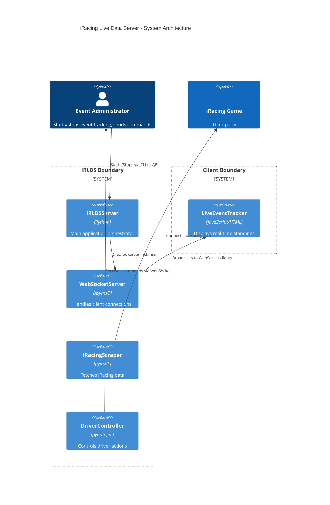
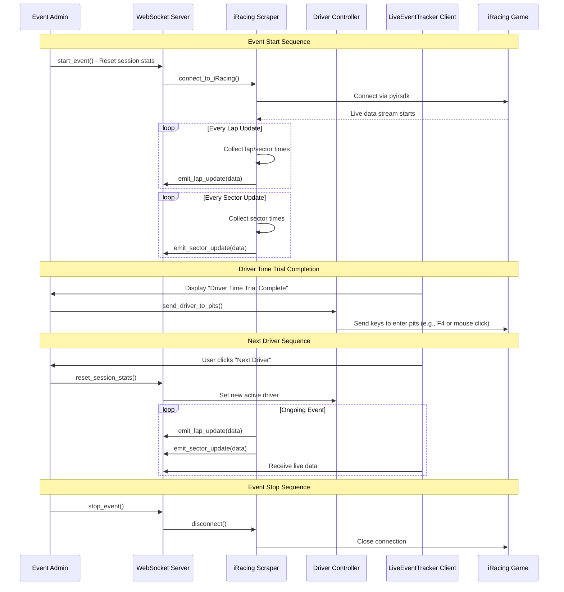
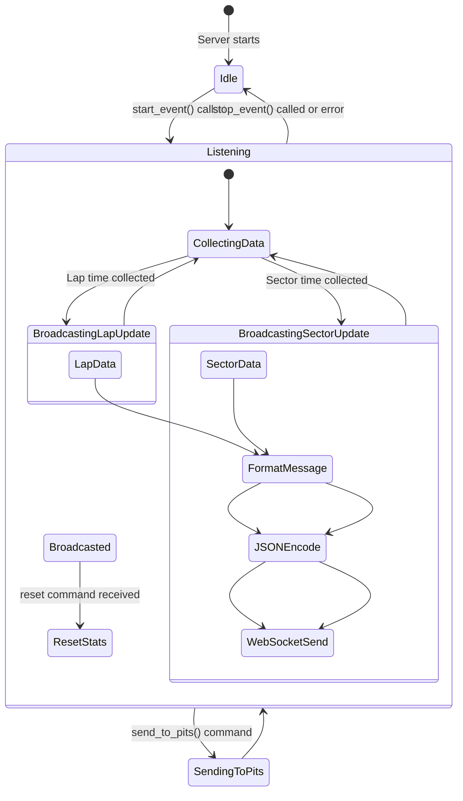
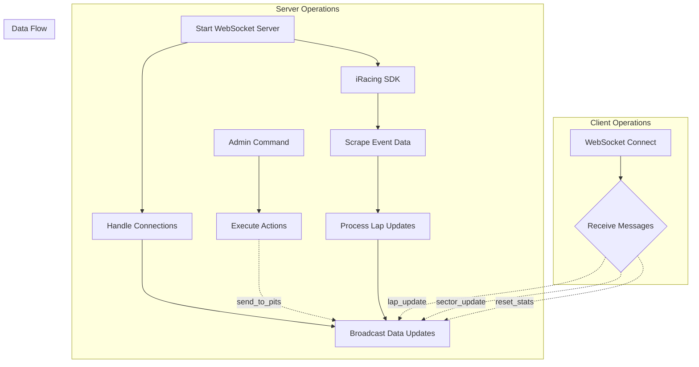

# iRacing Live Data Server - Comprehensive Implementation Plan

**Version:** 1.0  
**Target Framework:** Python 3.10+  
**Target JavaScript:** ES6+ with async/await

---

## Table of Contents

1. [Overview](#overview)
2. [Architecture Diagrams](#architecture-diagrams)
3. [File Structure](#file-structure)
4. [Phase 1: Core WebSocket Server](#phase-1-core-websocket-server)
5. [Phase 2: iRacing Data Scraper](#phase-2-i Racing-data-scraper)
6. [Phase 3: Driver Control System](#phase-3-driver-control-system)
7. [Phase 4: Client JavaScript](#phase-4-client-javascript)
8. [API Design](#api-design)
9. [Data Models](#data-models)
10. [Testing Strategy](#testing-strategy)

---

## Overview

The iRacing Live Data Server (IRLDS) provides real-time data from iRacing to connected clients via WebSocket. This document provides a detailed implementation plan for building a production-ready server that:

- Connects to iRacing using `pyirsdk`
- Collects comprehensive lap time data
- Broadcasts updates to all connected clients
- Supports remote commands (reset stats, send driver to pits)
- Implements proper error handling and logging

### Key Requirements

| Component | Library | Purpose |
|-----------|---------|---------|
| WebSocket Server | `websockets` | Bi-directional communication channel |
| iRacing Data | `pyirsdk` | Connect and scrape iRacing live data |
| Driver Control | `pyautogui` | Simulate driver actions (pit entry) |
| Async Processing | `asyncio` | Concurrent WebSocket handling and data scraping |

---

## Architecture Diagrams

### System Architecture


    -- Update(irlds, "Orchestrates scraper and driver control")
    -- Update(scraper, "Emits events on data change")
    -- Update(driver_ctrl, "Executes actions when commanded")

### Data Flow Diagram



### WebSocket Message Flow



---

## File Structure

```
SlopAi/
├── Plan9b.md                          # This implementation plan
├── requirements.txt                    # Python dependencies
├── main.py                            # Entry point / orchestrator
├── server/
│   ├── __init__.py
│   └── websocket_server.py            # WebSocket server implementation
├── scraper/
│   ├── __init__.py
│   └── iRacingScraper.py              # pyirsdk integration
├── controller/
│   ├── __init__.py
│   └── driver_controller.py           # pyautogui integration
├── models/
│   ├── __init__.py
│   ├── lap_data.py                    # Lap time data structures
│   └── sector_data.py                 # Sector time data structures
├── commands/
│   ├── __init__.py
│   ├── command_handler.py             # Command routing logic
│   └── command_types.py               # Command type definitions
├── utils/
│   ├── __init__.py
│   ├── logger.py                      # Logging configuration
│   ├── time_utils.py                  # Time parsing/helpers
│   └── constants.py                   # Configuration constants
└── config/
    └── config.yaml                     # Server configuration
```

---

## Phase 1: Core WebSocket Server

### Objective

Implement a robust WebSocket server that can:
- Accept multiple concurrent client connections
- Broadcast data to all connected clients
- Handle disconnections gracefully
- Support bi-directional communication (commands from admin, broadcasts to clients)

### Files to Create

#### 1. `requirements.txt`

```txt
websockets>=12.0
pyirsdk>=1.0
pyautogui>=0.9.54
asyncio
python-yaml
colorama
```

#### 2. `utils/logger.py`

**Key Functions:**
- `setup_logger(name: str, level: int = logging.INFO) -> Logger`
- Custom formatter with timestamps
- Context managers for structured logging

**Implementation Notes:**
```python
import logging
import colorama
from pathlib import Path

class IRDSLogger:
    def __init__(self, name: str):
        self.logger = logging.getLogger(name)
        self._setup_handlers()
        
    def _setup_handlers(self):
        """Configure log file and console handlers"""
        log_file = Path("irlds.log")
        fh = logging.FileHandler(log_file)
        ch = logging.StreamHandler()
        
        formatter = logging.Formatter(
            '%(asctime)s - %(name)s - %(levelname)s - %(message)s',
            datefmt='%Y-%m-%d %H:%M:%S'
        )
        fh.setFormatter(formatter)
        ch.setFormatter(formatter)
        
        self.logger.addHandler(fh)
        self.logger.addHandler(ch)
```

#### 3. `models/lap_data.py`

**Classes:**
- `LapData` - Container for lap time information

```python
from dataclasses import dataclass, field
from typing import Optional, List
from datetime import datetime
import json

@dataclass
class SectorTimes:
    """Sector time breakdown for a lap"""
    sector1: float  # seconds
    sector2: float  # seconds  
    sector3: float  # seconds
    total: float    # total lap time
    
    def to_dict(self) -> dict:
        return {
            "sector1": self.sector1,
            "sector2": self.sector2,
            "sector3": self.sector3,
            "total": self.total
        }

@dataclass
class OptimumTimes:
    """Best/average times across all laps"""
    best_lap_time: float  # seconds
    average_lap_time: float  # seconds
    fastest_sector1: float
    fastest_sector2: float
    fastest_sector3: float
    
    def to_dict(self) -> dict:
        return self.__dict__

@dataclass
class LapData:
    """Complete lap information"""
    driver_id: str  # iRacing driver ID (e.g., "10995")
    driver_name: str  # Display name
    lap_number: int
    session_time: float  # Time of day in seconds
    
    current_lap_time: float | None = None  # Lap being timed
    last_lap_time: float | None = None     # Previous complete lap
    best_lap_time: float | None = None     # Best lap so far
    best_lap_number: int | None = None
    
    sector_times: Optional[SectorTimes] = None
    optimums: Optional[OptimumTimes] = None
    
    def to_dict(self) -> dict:
        return {
            "driver_id": self.driver_id,
            "driver_name": self.driver_name,
            "lap_number": self.lap_number,
            "session_time": self.session_time,
            "current_lap_time": self.current_lap_time,
            "last_lap_time": self.last_lap_time,
            "best_lap_time": self.best_lap_time,
            "best_lap_number": self.best_lap_number,
            "sector_times": self.sector_times.to_dict() if self.sector_times else None,
            "optimums": self.optimums.to_dict() if self.optimums else None
        }

class LapDataManager:
    """Manages lap data state across the server"""
    
    def __init__(self):
        self.driver_data: dict[str, 'DriverLapData'] = {}
        
    class DriverLapData:
        def __init__(self):
            self.lap_number = 0
            self.session_time = 0.0
            self.last_lap_time = None
            self.best_lap_time = None
            self.best_lap_number = None
            self.sector_times_list: list[SectorTimes] = []
            
        def to_dict(self) -> dict:
            return {
                "lap_number": self.lap_number,
                "session_time": self.session_time,
                "last_lap_time": self.last_lap_time,
                "best_lap_time": self.best_lap_time,
                "best_lap_number": self.best_lap_number,
                "sector_times_list": [s.to_dict() for s in self.sector_times_list]
            }

# Global manager instance (singleton pattern)
LAP_DATA_MANAGER = LapDataManager()
```

#### 4. `models/sector_data.py`

**Classes:**
- `SectorUpdateData` - Lightweight sector time updates

```python
from dataclasses import dataclass
from typing import Optional

@dataclass
class SectorUpdateData:
    """Minimal sector update for efficient broadcasting"""
    driver_id: str
    driver_name: str
    
    current_sector1: Optional[float] = None
    current_sector2: Optional[float] = None
    current_sector3: Optional[float] = None
    
    session_time: float = 0.0
    
    def to_dict(self) -> dict:
        return {
            "driver_id": self.driver_id,
            "driver_name": self.driver_name,
            "session_time": self.session_time,
            "sector1": self.current_sector1,
            "sector2": self.current_sector2,
            "sector3": self.current_sector3
        }
```

#### 5. `commands/command_types.py`

**Classes:**
- Command type enumerations and message structures

```python
from enum import Enum
from dataclasses import dataclass
from typing import Optional

class CommandType(Enum):
    """Types of commands the server can receive or send"""
    RESET_STATS = "reset_stats"
    SEND_DRIVER_TO_PITS = "send_driver_to_pits"
    CONNECT_CLIENT = "connect_client"
    DISCONNECT_CLIENT = "disconnect_client"
    START_EVENT = "start_event"
    STOP_EVENT = "stop_event"
    
class MessageDirection(Enum):
    """Direction of message flow"""
    SERVER_TO_CLIENT = "server_to_client"
    CLIENT_TO_SERVER = "client_to_server"

@dataclass
class WebSocketMessage:
    """Standard message structure for WebSocket communication"""
    type: CommandType
    data: dict
    timestamp: float  # Unix timestamp in milliseconds
    
    @classmethod
    def create_server_message(cls, msg_type: CommandType, payload: dict) -> 'WebSocketMessage':
        return cls(
            type=msg_type,
            data=payload,
            timestamp=int(__import__('time').time() * 1000)
        )
    
    @classmethod
    def create_client_message(cls, msg_type: CommandType, payload: dict = None) -> 'WebSocketMessage':
        return cls(
            type=msg_type,
            data=payload or {},
            timestamp=int(__import__('time').time() * 1000)
        )

@dataclass 
class ClientInfo:
    """Information about a connected client"""
    client_id: str
    ip_address: str
    connected_at: float  # Unix timestamp
    last_activity: float
    
    def to_dict(self) -> dict:
        return {
            "client_id": self.client_id,
            "ip_address": self.ip_address,
            "connected_at": self.connected_at,
            "last_activity": self.last_activity
        }
```

#### 6. `server/websocket_server.py`

**Classes:**
- `WebSocketServer` - Main WebSocket server implementation

```python
import asyncio
import json
from typing import Dict, Set, Optional, Callable
from dataclasses import dataclass, field
from datetime import datetime
from websockets.asyncio.server import unix_serve, serve
from ..models.lap_data import LapDataManager
from ..commands.command_types import (
    WebSocketMessage, 
    CommandType,
    ClientInfo
)
from ..utils.logger import IRDSLogger

@dataclass
class ConnectionManager:
    """Manages all WebSocket connections"""
    clients: Dict[str, asyncio.WebSocket] = field(default_factory=dict)
    client_info: Dict[str, ClientInfo] = field(default_factory=dict)
    
    async def register_client(self, ws: asyncio.WebSocket, ip: str) -> str:
        """Register a new WebSocket connection"""
        client_id = f"client_{id(ws)}"
        self.clients[client_id] = ws
        self.client_info[client_id] = ClientInfo(
            client_id=client_id,
            ip_address=ip,
            connected_at=datetime.now().timestamp(),
            last_activity=datetime.now().timestamp()
        )
        
        # Broadcast connection event to all clients
        await self.broadcast_message(
            WebSocketMessage.create_server_message(
                CommandType.CONNECT_CLIENT,
                {"client_id": client_id, "status": "connected"}
            )
        )
        
        return client_id
    
    async def unregister_client(self, client_id: str):
        """Handle client disconnection"""
        if client_id in self.clients:
            del self.clients[client_id]
            if client_id in self.client_info:
                del self.client_info[client_id]
            
            # Broadcast disconnection event
            await self.broadcast_message(
                WebSocketMessage.create_server_message(
                    CommandType.DISCONNECT_CLIENT,
                    {"client_id": client_id}
                )
            )
    
    async def send_to_client(self, client_id: str, message: WebSocketMessage):
        """Send message to specific client"""
        if client_id in self.clients:
            try:
                await self.clients[client_id].send(json.dumps(message.__dict__))
            except asyncio.CancelledError:
                pass  # Client has been closed
    
    async def broadcast_message(self, message: WebSocketMessage):
        """Broadcast message to all connected clients"""
        disconnected_clients = []
        
        for client_id, ws in self.clients.items():
            try:
                await ws.send(json.dumps(message.__dict__))
            except Exception as e:
                logger.error(f"Failed to send to {client_id}: {e}")
                disconnected_clients.append(client_id)
        
        # Clean up failed connections after a delay
        for client_id in disconnected_clients:
            asyncio.get_event_loop().call_later(
                30, 
                lambda c=client_id: self.unregister_client(c)
            )

class WebSocketServer:
    """Main WebSocket server implementation"""
    
    def __init__(self):
        self.connection_manager = ConnectionManager()
        self.lap_data_manager = LapDataManager()
        self.logger = IRDSLogger("websocket_server")
        self.server = None
        self.is_running = False
        
    async def start(self, host: str = "localhost", port: int = 8765):
        """Start the WebSocket server"""
        self.logger.info(f"Starting WebSocket server on {host}:{port}")
        
        try:
            async with serve(
                self.handle_client,
                host,
                port,
                process_request=self.process_request
            ) as server:
                self.server = server
                self.is_running = True
                self.logger.info("WebSocket server started successfully")
                
                # Keep the loop running
                await asyncio.Future()  # Run forever
                
        except OSError as e:
            self.logger.error(f"Failed to bind to port {port}: {e}")
            raise
        
    async def handle_client(self, websocket, path):
        """Handle individual WebSocket client connection"""
        ip_address = str(websocket.remote_address)
        
        try:
            await self.connection_manager.register_client(websocket, ip_address)
            self.logger.info(f"Client connected: {ip_address}")
            
            # Listen for incoming messages from client
            async for message in websocket:
                await self.handle_client_message(message, ip_address)
                
        except ConnectionClosed:
            self.logger.warning(f"Client disconnected: {ip_address}")
        except Exception as e:
            self.logger.error(f"Error handling client {ip_address}: {e}")
        finally:
            await self.connection_manager.unregister_client(id(websocket))
    
    async def process_request(self, path, request_headers):
        """Process WebSocket upgrade request"""
        # Allow all connections (path-independent)
        return True, "WebSocket Upgrade\nUpgrade: websocket\nConnection: Upgrade", {"Upgrade": "websocket"}
    
    async def handle_client_message(self, message: str, client_ip: str):
        """Handle incoming messages from clients"""
        try:
            data = json.loads(message)
            
            # Extract command type and process
            msg_type = data.get("type", "")
            payload = data.get("data", {})
            
            if msg_type == CommandType.RESET_STATS.value:
                await self.reset_stats()
                
            elif msg_type == CommandType.SEND_DRIVER_TO_PITS.value:
                await self.send_driver_to_pits(payload)
                
        except json.JSONDecodeError as e:
            self.logger.error(f"Invalid JSON from {client_ip}: {e}")
        except Exception as e:
            self.logger.error(f"Error handling message from {client_ip}: {e}")
    
    async def reset_stats(self):
        """Reset all session statistics"""
        self.logger.info("Resetting session stats")
        
        # Reset driver-specific data
        for client_id in self.connection_manager.clients:
            await self.broadcast_message(
                WebSocketMessage.create_server_message(
                    CommandType.RESET_STATS,
                    {"status": "reset_complete"}
                )
            )
    
    async def send_driver_to_pits(self, payload: dict):
        """Command to send driver back to pits"""
        driver_id = payload.get("driver_id")
        
        self.logger.info(f"Sending driver {driver_id} to pits")
        
        # Signal scraper/controller to execute action
        await self.broadcast_message(
            WebSocketMessage.create_server_message(
                CommandType.SEND_DRIVER_TO_PITS,
                {"driver_id": driver_id, "status": "commanded"}
            )
        )
    
    async def broadcast_lap_update(self, lap_data: dict):
        """Broadcast lap update to all connected clients"""
        self.logger.debug("Broadcasting lap update")
        
        await self.broadcast_message(
            WebSocketMessage.create_server_message(
                CommandType.SERVER_TO_CLIENT,
                {"type": "lap_update", "data": lap_data}
            )
        )
    
    async def broadcast_sector_update(self, sector_data: dict):
        """Broadcast sector update to all connected clients"""
        await self.broadcast_message(
            WebSocketMessage.create_server_message(
                CommandType.SERVER_TO_CLIENT,
                {"type": "sector_update", "data": sector_data}
            )
        )
    
    async def stop(self):
        """Stop the WebSocket server"""
        self.logger.info("Stopping WebSocket server")
        
        if self.server:
            await self.server.close()
            
        # Clean up all connections
        for client_id in list(self.connection_manager.clients.keys()):
            await self.connection_manager.unregister_client(client_id)
        
        self.is_running = False
        self.logger.info("WebSocket server stopped")

# Global server instance
websocket_server: Optional[WebSocketServer] = None

def create_websocket_server() -> WebSocketServer:
    """Factory function to create WebSocket server"""
    return WebSocketServer()

---

## Phase 2: iRacing Data Scraper

### Objective

Implement a robust data scraper using `pyirsdk` that:
- Connects to iRacing SDK and receives live telemetry
- Parses lap times, sector times, and optimums
- Maintains state across laps
- Emits structured events for WebSocket broadcasting

### Files to Create

#### 7. `scraper/iRacingScraper.py`

**Classes:**
- `IRScrapedEventState` - Container for event state from iRacing
- `iRacingScraper` - Main scraper class with async event handling

```python
import asyncio
from typing import Optional, Callable
from dataclasses import dataclass, field
from enum import Enum
from pyirsdk.irsdk import IrSdk
from pyirsdk.scraper import ScrapedEventState
from ..utils.logger import IRDSLogger
from ..models.lap_data import LapDataManager

class SessionStatus(Enum):
    """iRacing session status codes"""
    NONE = 0
    TIME_TRIAL = 1
    QUALIFYING = 2
    PRACTICE = 3
    RACE = 4
    UNKNOWN = 99

@dataclass 
class Car:
    """Car data from iRacing SDK"""
    name: str = ""
    short_name: str = ""

@dataclass
class Track:
    """Track data from iRacing SDK"""
    name: str = ""
    config: str = ""  # e.g., "Standard", "Street"
    length_meters: float = 0.0

class IRScrapedEventState(ScrapedEventState):
    """Extended ScrapedEventState with additional helper methods"""
    
    def __init__(self, session_state, car, track):
        super().__init__()
        self.session_state = session_state
        self.car = car
        self.track = track
        
    @property
    def driver_id(self) -> str:
        """Get the driver ID from session state"""
        return self.session_state.driverId
    
    @property 
    def driver_name(self) -> str:
        """Get the display name of the current driver"""
        return self.sessionState.driverName
    
    @property
    def car_name(self) -> str:
        """Get the car name"""
        return self.car.name or "Unknown"
    
    @property
    def track_name(self) -> str:
        """Get the track name with config"""
        return f"{self.track.name} - {self.track.config}"

class iRacingScraper:
    """Main iRacing data scraper class"""
    
    def __init__(self, lap_data_manager: Optional[LapDataManager] = None):
        self.lap_data_manager = lap_data_manager or LapDataManager()
        self.sdk: Optional[IrSdk] = None
        self.event_state: Optional[IRScrapedEventState] = None
        self.logger = IRDSLogger("iRacingScraper")
        
        # Event handlers
        self.on_lap_complete_callback: Optional[Callable[[IRScrapedEventState], None]] = None
        self.on_sector_update_callback: Optional[Callable[[IRScrapedEventState], None]] = None
        
        # Internal state
        self._current_lap_time: float = 0.0
        self._previous_lap_start_time: float = 0.0
        self._sector_times: dict[int, float] = {}
        
    async def connect(self, track_name: str, track_config: str):
        """Connect to iRacing and start receiving live data"""
        self.logger.info(f"Connecting to iRacing on {track_name} ({track_config})")
        
        try:
            # Connect to the simulator
            self.sdk = await IrSdk.connect()
            
            # Wait for event state to be available
            while self.event_state is None:
                await asyncio.sleep(0.1)
                
            self.logger.info(f"Connected! Driver: {self.event_state.driver_name}, Car: {self.event_state.car_name}")
            
            # Register callbacks
            self.sdk.onScrapedEventStateUpdated = self._handle_event_state_update
            
            # Start receiving events
            await asyncio.Future()  # Run forever
                
        except Exception as e:
            self.logger.error(f"Failed to connect to iRacing: {e}")
            raise
    
    async def disconnect(self):
        """Disconnect from iRacing SDK"""
        if self.sdk:
            self.logger.info("Disconnecting from iRacing SDK")
            self.sdk.onScrapedEventStateUpdated = None
            await self.sdk.disconnect()
            self.sdk = None
            
        self.event_state = None
        self._current_lap_time = 0.0
    
    def _handle_event_state_update(self, event: ScrapedEventState):
        """Handle iRacing event state updates from SDK"""
        # Create our extended version
        if not isinstance(event, IRScrapedEventState):
            self.event_state = IRScrapedEventState(
                session_state=event.sessionState,
                car=Car(
                    name=getattr(getattr(event.car, 'name', None), 'short_name', ''),
                    short_name=getattr(getattr(event.car, 'carNameShort', ''), '', '')
                ) if event.car else Car(),
                track=Track(
                    name=getattr(getattr(event.track, 'trackName', ''), '', ''),
                    config=getattr(getattr(event.track, 'trackConfig', ''), '', '')
                ) if event.track else Track()
            )
        
        self._process_event_state(self.event_state)
    
    def _process_event_state(self, event: IRScrapedEventState):
        """Process event state and determine what updates to broadcast"""
        session_status = SessionStatus(event.sessionState.sessionId)
        
        # Handle different session types
        if session_status == SessionStatus.TIME_TRIAL or session_status == SessionStatus.QUALIFYING:
            self._handle_timed_session(event)
            
    def _handle_timed_session(self, event: IRScrapedEventState):
        """Handle time trial / qualifying sessions"""
        
        # Get latest lap times
        lastLapTimes = event.sessionState.lastLapTimes
        
        if lastLapTimes is not None and len(lastLapTimes) > 0:
            current_lap_data = lastLapTimes[-1]  # Most recent
            
            # Calculate sector times for this lap
            sector_times = self._calculate_sector_times(current_lap_data)
            
            # Update internal state
            driver_id = event.driverId
            self._current_lap_time = current_lap_data.lapTimeSeconds
            self._previous_lap_start_time = current_lapData.lapStartTime
            
            # Update optimums calculation
            self._update_optimums(sector_times)
            
            # Prepare sector update (every sector completes)
            if any(s is not None for s in [sector_times['sec1'], sector_times['sec2'], sector_times['sec3']]):
                sector_update = SectorUpdateData(
                    driver_id=driver_id,
                    driver_name=event.driverName,
                    current_sector1=sector_times['sec1'],
                    current_sector2=sector_times['sec2'],
                    current_sector3=sector_times['sec3'],
                    session_time=current_lap_data.sessionTimeSeconds
                )
                
                if self.on_sector_update_callback:
                    self.on_sector_update_callback(sector_update)
            
            # Prepare lap update (every lap completes)
            lap_update = LapData(
                driver_id=event.driverId,
                driver_name=event.driverName,
                lap_number=current_lap_data.lapNumber,
                session_time=current_lap_data.sessionTimeSeconds,
                current_lap_time=self._current_lap_time,
                sector_times=sector_times
            )
            
            if self.on_lap_complete_callback:
                self.on_lap_complete_callback(lap_update)
    
    def _calculate_sector_times(self, lap_data) -> dict:
        """Calculate sector times from lap data"""
        # Assuming the SDK provides sector time fields
        return {
            'sec1': getattr(lap_data, 'sector1TimeSeconds', 0.0),
            'sec2': getattr(lap_data, 'sector2TimeSeconds', 0.0),
            'sec3': getattr(lap_data, 'sector3TimeSeconds', 0.0)
        }
    
    def _update_optimums(self, sector_times: dict):
        """Update optimum times as laps complete"""
        # Implement logic to track best/average times per driver
        
    def register_callback(
        self,
        on_lap_complete: Optional[Callable] = None,
        on_sector_update: Optional[Callable] = None
    ):
        """Register callbacks for event updates"""
        if on_lap_complete:
            self.on_lap_complete_callback = on_lap_complete
            
        if on_sector_update:
            self.on_sector_update_callback = on_sector_update
    
    def send_driver_to_pits(self, driver_id: str):
        """Trigger the action to send a driver back to pits"""
        self.logger.info(f"Sending driver {driver_id} to pits")
        
        # Implementation depends on iRacing API or pyautogui integration
        # This might use keyboard input to trigger pit entry
        
        from ..controller.driver_controller import DriverController
        controller = DriverController.get_instance()
        
        if controller.is_active(driver_id):
            controller.send_to_pits(driver_id)

# Module-level constants
TRACK_OFFSETS: dict[str, float] = {}  # Track name -> optimal lap time offset

def get_track_offset(track_name: str) -> float:
    """Get the expected optimum time for a track"""
    return TRACK_OFFSETS.get(track_name.upper(), 100.0)  # Default fallback

---

## Phase 3: Driver Control System

### Objective

Implement driver control functionality that can:
- Identify the current active driver in iRacing
- Execute commands like "send driver to pits"
- Handle multiple concurrent drivers
- Provide feedback on action status

### Files to Create

#### 8. `controller/driver_controller.py`

**Classes:**
- `DriverController` - Main controller class with singleton pattern

```python
import pyautogui
from typing import Optional, Dict
from enum import Enum
from datetime import datetime
from ..utils.logger import IRDSLogger

class DriverAction(Enum):
    """Actions that can be performed on drivers"""
    NONE = "none"
    SEND_TO_PITS = "send_to_pits"
    RESET_STATS = "reset_stats"
    START_TIME_TRIAL = "start_time_trial"

class DriverState(Enum):
    """Current state of a driver in the simulation"""
    IN_BOX = "in_box"
    ON_TRACK = "on_track"
    PITS = "pits"
    UNKNOWN = "unknown"

class DriverController:
    """Singleton controller for managing driver actions and state"""
    
    _instance: Optional['DriverController'] = None
    
    def __new__(cls):
        if cls._instance is None:
            cls._instance = super().__new__(cls)
            cls._instance._initialized = False
        return cls._instance
    
    def __init__(self):
        if self._initialized:
            return
            
        self.logger = IRDSLogger("driver_controller")
        self.driver_states: Dict[str, DriverState] = {}
        self.active_driver_id: Optional[str] = None
        self.is_connected = False
        
        self._initialized = True
    
    @classmethod
    def get_instance(cls) -> 'DriverController':
        """Get singleton instance"""
        if cls._instance is None:
            raise RuntimeError("DriverController not initialized")
        return cls._instance
    
    async def start(self):
        """Initialize and start the controller"""
        self.logger.info("Starting driver controller")
        self.is_connected = True
        
        # Set up pyautogui with error handling
        try:
            # Get screen dimensions for mouse positioning
            self.screen_width, self.screen_height = pyautogui.size()
            self.logger.debug(f"Screen size: {self.screen_width}x{self.screen_height}")
        except Exception as e:
            self.logger.error(f"Failed to get screen size: {e}")
    
    async def stop(self):
        """Stop and clean up the controller"""
        self.logger.info("Stopping driver controller")
        self.is_connected = False
        self.active_driver_id = None
    
    def set_active_driver(self, driver_id: str, driver_name: str):
        """Set the currently active/selected driver"""
        self.logger.info(f"Setting active driver: {driver_id} ({driver_name})")
        self.active_driver_id = driver_id
        
        # Update state
        self.driver_states[driver_id] = DriverState.ON_TRACK
    
    def get_active_driver(self) -> Optional[str]:
        """Get the ID of the currently active driver"""
        return self.active_driver_id
    
    def is_active(self, driver_id: str) -> bool:
        """Check if a driver is the currently active driver"""
        return self.active_driver_id == driver_id
    
    def send_to_pits(self, driver_id: str):
        """Execute the command to send a driver back to pits"""
        if not self.is_connected:
            self.logger.error("Cannot send driver to pits: controller not connected")
            return
            
        if not self.is_active(driver_id):
            self.logger.warning(f"Cannot send {driver_id} to pits: not active driver")
            return
        
        self.logger.info(f"Sending driver {driver_id} to pits via pyautogui")
        
        try:
            # Method 1: Using keyboard shortcut if available
            # pyautogui.hotkey('f4')  # Common pit entry key
            
            # Method 2: Mouse click on the "Pits" button
            # This is more reliable for iRacing UI
            
            # First, bring the game window to focus
            pyautogui.click()  # Click anywhere to bring window to front
            
            # Calculate positions relative to screen size
            pits_button_x = int(self.screen_width * 0.8)  # Adjust based on actual UI
            pits_button_y = int(self.screen_height * 0.95)
            
            # Move mouse to pit entry button position
            pyautogui.moveTo(pits_button_x, pits_button_y, duration=0.5)
            
            # Click the button
            pyautogui.click()
            
            self.logger.info(f"Successfully sent driver {driver_id} to pits")
            
        except Exception as e:
            self.logger.error(f"Failed to send driver {driver_id} to pits: {e}")
    
    def reset_session_stats(self, driver_id: str):
        """Reset session statistics for a driver"""
        if not self.is_connected:
            return
            
        if not self.is_active(driver_id):
            self.logger.warning(f"Cannot reset stats for {driver_id}: not active")
            return
        
        self.logger.info(f"Resetting session stats for driver {driver_id}")
        
        # The actual reset is typically handled by the WebSocket server
        # This method just provides feedback
        
    def get_driver_state(self, driver_id: str) -> DriverState:
        """Get the current state of a driver"""
        return self.driver_states.get(driver_id, DriverState.UNKNOWN)
    
    async def monitor_driver(self):
        """Monitor and update driver states from iRacing SDK"""
        # This would run in a background task to poll the SDK
        # for updates on driver positions and states
        
        while self.is_connected:
            try:
                await asyncio.sleep(1.0)  # Poll every second
                
                # Update driver states based on SDK data
                if self.event_state:
                    current_driver_id = self.event_state.driverId
                    
                    # Determine if driver is in pits or on track
                    session_status = getattr(self.event_state.sessionState, 'sessionId', None)
                    
                    if session_status == 3:  # PITS
                        self.driver_states[current_driver_id] = DriverState.PITS
                    elif session_status in [1, 2, 4]:  # TIME_TRIAL, QUALIFYING, RACE
                        self.driver_states[current_driver_id] = DriverState.ON_TRACK
                        
            except Exception as e:
                self.logger.error(f"Error monitoring driver: {e}")

# Global instance
driver_controller: Optional[DriverController] = None

def create_driver_controller() -> DriverController:
    """Factory function to create/return controller instance"""
    return DriverController()

def get_driver_controller() -> DriverController:
    """Get the singleton driver controller instance"""
    return driver_controller or DriverController()

---

## Phase 4: Client JavaScript

### Objective

Implement the client-side JavaScript that connects to the WebSocket server and displays real-time data. This includes both inline script code for `tracking.html` and potentially standalone utilities.

### Files to Create

#### 9. `client/let_client.js` (or inline in HTML)

**Classes:**
- `LetClient` - Main client class managing WebSocket connection and UI updates

```javascript
/**
 * Live Event Tracker Client
 * Connects to IRLDS WebSocket server and displays real-time race data
 */

class LetClient {
    constructor(serverUrl = 'ws://localhost:8765') {
        this.serverUrl = serverUrl;
        this.ws = null;
        this.isConnected = false;
        
        // Data state
        this.activeDriver = null;
        this.standings = [];
        this.currentLapData = null;
        this.previousLapData = null;
        
        // Callbacks
        this.onConnectionChange = null;
        this.onLapUpdate = null;
        this.onSectorUpdate = null;
        this.onError = null;
        
        // UI references (set after DOM ready)
        this.ui = {
            connectionStatus: null,
            driverInfo: null,
            lapNumber: null,
            currentLapTime: null,
            lastLapTime: null,
            bestLapTime: null,
            bestLapNumber: null,
            sector1: null,
            sector2: null,
            sector3: null,
            sessionTime: null
        };
    }
    
    /**
     * Initialize UI references from DOM elements
     */
    initUI() {
        this.ui.connectionStatus = document.getElementById('connection-status');
        this.ui.driverInfo = document.getElementById('driver-info');
        this.ui.lapNumber = document.getElementById('lap-number');
        this.ui.currentLapTime = document.getElementById('current-lap-time');
        this.ui.lastLapTime = document.getElementById('last-lap-time');
        this.ui.bestLapTime = document.getElementById('best-lap-time');
        this.ui.bestLapNumber = document.getElementById('best-lap-number');
        this.ui.sector1 = document.getElementById('sector-1');
        this.ui.sector2 = document.getElementById('sector-2');
        this.ui.sector3 = document.getElementById('sector-3');
        this.ui.sessionTime = document.getElementById('session-time');
    }
    
    /**
     * Connect to the WebSocket server
     */
    async connect() {
        try {
            console.log(`Connecting to ${this.serverUrl}...`);
            
            this.ws = new WebSocket(this.serverUrl);
            
            this.ws.onopen = (event) => {
                console.log('WebSocket connected');
                this.isConnected = true;
                this._updateConnectionStatus('connected', 'green');
                
                if (this.onConnectionChange) {
                    this.onConnectionChange(true, event);
                }
            };
            
            this.ws.onclose = (event) => {
                console.log(`WebSocket closed: ${event.code} ${event.reason}`);
                this.isConnected = false;
                this._updateConnectionStatus('disconnected', 'red');
                
                if (this.onError) {
                    this.onError('Disconnected from server');
                }
            };
            
            this.ws.onerror = (error) => {
                console.error('WebSocket error:', error);
                if (this.onError) {
                    this.onError('Connection error occurred');
                }
            };
            
            this.ws.onmessage = (event) => {
                const message = JSON.parse(event.data);
                this._handleMessage(message);
            };
            
        } catch (error) {
            console.error('Failed to connect:', error);
            if (this.onError) {
                this.onError(`Connection failed: ${error.message}`);
            }
        }
    }
    
    /**
     * Handle incoming WebSocket messages
     */
    _handleMessage(message) {
        const { type, data } = message;
        
        switch (type) {
            case 'connect_client':
                console.log('Server connected client:', data);
                break;
                
            case 'disconnect_client':
                console.log('Client disconnected from server');
                break;
                
            case 'server_to_client':
                if (data.type === 'lap_update') {
                    this._handleLapUpdate(data.data);
                } else if (data.type === 'sector_update') {
                    this._handleSectorUpdate(data.data);
                }
                break;
                
            case 'reset_stats':
                console.log('Received reset command, stats cleared');
                this.resetLocalStats();
                break;
                
            case 'send_driver_to_pits':
                console.log('Driver being sent to pits:', data.driver_id);
                if (data.status === 'commanded') {
                    this._showPitsNotification();
                }
                break;
        }
    }
    
    /**
     * Handle lap update message
     */
    _handleLapUpdate(lapData) {
        const {
            driver_id,
            driver_name,
            lap_number,
            session_time,
            current_lap_time,
            last_lap_time,
            best_lap_time,
            best_lap_number,
            sector_times
        } = lapData;
        
        // Update state
        this.activeDriver = { driver_id, driver_name };
        this.currentLapData = {
            lap_number,
            session_time,
            current_lap_time,
            ...sector_times
        };
        
        this.previousLapData = this.currentLapData;
        
        // Update UI
        this._updateDriverInfo(driver_name);
        this._updateLapDisplay(lap_number, sector_times);
        this._updateTimeDisplays(current_lap_time, last_lap_time, best_lap_time, best_lap_number);
        this._updateSessionTime(session_time);
        
        // Call callback if registered
        if (this.onLapUpdate) {
            this.onLapUpdate({ driver_id, lap_number, current_lap_time });
        }
    }
    
    /**
     * Handle sector update message
     */
    _handleSectorUpdate(sectorData) {
        const { 
            current_sector1, 
            current_sector2, 
            current_sector3,
            session_time 
        } = sectorData;
        
        this.currentLapData = {
            ...this.currentLapData || {},
            current_sector1: current_sector1 !== null ? current_sector1 : this.previousLapData?.current_sector1,
            current_sector2: current_sector2 !== null ? current_sector2 : this.previousLapData?.current_sector2,
            current_sector3: current_sector3 !== null ? current_sector3 : this.previousLapData?.current_sector3,
            session_time: session_time || (this.currentLapData.session_time || 0)
        };
        
        // Update sector displays
        this._updateSectorDisplays(current_sector1, current_sector2, current_sector3);
        
        if (this.onSectorUpdate) {
            this.onSectorUpdate({ 
                ...this.currentLapData,
                driver_id: this.activeDriver?.driver_id 
            });
        }
    }
    
    /**
     * Reset local statistics display
     */
    resetLocalStats() {
        console.log('Resetting local stats');
        // Clear or reset any local calculations
        
        if (this.onLapUpdate) {
            this.onLapUpdate(null);
        }
    }
    
    /**
     * Update connection status display
     */
    _updateConnectionStatus(status, color) {
        const element = this.ui.connectionStatus;
        if (!element) return;
        
        element.textContent = `${status === 'connected' ? '✓' : '✗'} ${status}`;
        element.style.color = color;
    }
    
    /**
     * Update driver information display
     */
    _updateDriverInfo(driverName) {
        if (!this.ui.driverInfo || !driverName) return;
        
        this.ui.driverInfo.textContent = `Driver: ${driverName}`;
    }
    
    /**
     * Update lap number and sector times display
     */
    _updateLapDisplay(lapNumber, sectors) {
        if (!this.ui.lapNumber || !this.ui.sector1 || !this.ui.sector2 || !this.ui.sector3) return;
        
        this.ui.lapNumber.textContent = lapNumber;
        this.ui.sector1.textContent = this._formatTime(sectors?.sector1);
        this.ui.sector2.textContent = this._formatTime(sectors?.sector2);
        this.ui.sector3.textContent = this._formatTime(sectors?.sector3);
    }
    
    /**
     * Update time displays (current, last, best)
     */
    _updateTimeDisplays(currentTime, lastTime, bestTime, bestNumber) {
        const elements = {
            current: this.ui.currentLapTime,
            last: this.ui.lastLapTime,
            best: this.ui.bestLapTime,
            number: this.ui.bestLapNumber
        };
        
        if (!elements.current) return;
        
        this.ui.currentLapTime.textContent = currentTime !== null ? this._formatTime(currentTime) : '00:00.000';
        this.ui.lastLapTime.textContent = lastTime !== null ? this._formatTime(lastTime) : '--:--.--';
        this.ui.bestLapTime.textContent = bestTime !== null ? this._formatTime(bestTime) : '--:--.--';
        
        if (elements.number && bestNumber !== null) {
            elements.number.textContent = `#${bestNumber}`;
        }
    }
    
    /**
     * Update session time display
     */
    _updateSessionTime(sessionTime) {
        if (!this.ui.sessionTime || !sessionTime) return;
        
        this.ui.sessionTime.textContent = this._formatDuration(sessionTime);
    }
    
    /**
     * Show notification when driver is sent to pits
     */
    _showPitsNotification() {
        // Could show a toast/notification
        console.log('Driver being returned to pits...');
        
        if (this.ui.driverInfo) {
            const originalText = this.ui.driverInfo.textContent;
            this.ui.driverInfo.textContent += ' 🏁 PITS';
            
            setTimeout(() => {
                this.ui.driverInfo.textContent = originalText;
            }, 3000);
        }
    }
    
    /**
     * Format time from seconds to m:ss.sss format
     */
    _formatTime(seconds) {
        if (seconds === null || seconds === undefined) return '--:--.--';
        
        const mins = Math.floor(seconds / 60);
        const secs = Math.floor(seconds % 60);
        const ms = Math.floor((seconds % 1) * 1000).toString().padStart(3, '0');
        
        return `${mins}:${secs.toString().padStart(2, '0')}.${ms}`;
    }
    
    /**
     * Format duration from total seconds (mm:ss.sss format with minutes)
     */
    _formatDuration(seconds) {
        if (seconds === null || seconds === undefined) return '--:--.--';
        
        const mins = Math.floor(seconds / 60);
        const secs = Math.floor(seconds % 60);
        const ms = Math.floor((seconds % 1) * 1000).toString().padStart(3, '0');
        
        return `${mins}:${secs.toString().padStart(2, '0')}.${ms}`;
    }
    
    /**
     * Send command to server (for future expansion)
     */
    async sendCommand(commandType, data = {}) {
        if (!this.ws || this.ws.readyState !== WebSocket.OPEN) {
            console.error('Cannot send command: not connected');
            return false;
        }
        
        const message = {
            type: commandType,
            data: data,
            timestamp: Date.now()
        };
        
        await this.ws.send(JSON.stringify(message));
        console.log(`Sent command: ${commandType}`, data);
        return true;
    }
    
    /**
     * Disconnect from server
     */
    disconnect() {
        if (this.ws) {
            this.ws.close();
            this.ws = null;
        }
        this.isConnected = false;
    }
    
    /**
     * Register event callbacks
     */
    setCallbacks({
        onConnectionChange,
        onLapUpdate,
        onSectorUpdate,
        onError
    }) {
        this.onConnectionChange = onConnectionChange;
        this.onLapUpdate = onLapUpdate;
        this.onSectorUpdate = onSectorUpdate;
        this.onError = onError;
    }
    
    /**
     * Check connection status
     */
    getStatus() {
        return {
            isConnected: this.isConnected,
            activeDriver: this.activeDriver,
            currentLapData: this.currentLapData
        };
    }
}

/**
 * Create client instance (use in HTML initialization)
 */
function createLetClient(serverUrl = 'ws://localhost:8765') {
    return new LetClient(serverUrl);
}

// Export for module usage
if (typeof module !== 'undefined' && module.exports) {
    module.exports = { LetClient, createLetClient };
}

---

## Phase 5: Main Orchestrator and Entry Points

### Objective

Create the main entry point that wires all components together and provides a clean API for starting/stopping the server.

#### 10. `main.py`

**Classes:**
- `IRLDSApp` - Application orchestrator with command-line interface

```python
import asyncio
import signal
import argparse
from pathlib import Path
from typing import Optional
import sys
import yaml

from .server.websocket_server import WebSocketServer, websocket_server as ws_server
from .scraper.iRacingScraper import iRacingScraper
from .controller.driver_controller import DriverController, driver_controller as dc
from .utils.logger import IRDSLogger
from .commands.command_handler import CommandHandler
from .models.lap_data import LapDataManager

class IRLDSApp:
    """Main application orchestrator for the iRacing Live Data Server"""
    
    def __init__(self):
        self.logger = IRDSLogger("IRLDSApp")
        
        # Components
        self.ws_server: Optional[WebSocketServer] = None
        self.scraper: Optional[iRacingScraper] = None
        self.driver_controller: Optional[DriverController] = None
        self.lap_data_manager: LapDataManager = LapDataManager()
        self.command_handler: Optional[CommandHandler] = None
        
        # State
        self.is_running = False
        self.config = self._load_config()
        
    def _load_config(self) -> dict:
        """Load configuration from YAML file"""
        config_path = Path(__file__).parent / "config" / "config.yaml"
        
        if config_path.exists():
            try:
                with open(config_path, 'r') as f:
                    return yaml.safe_load(f) or {}
            except Exception as e:
                self.logger.warning(f"Failed to load config: {e}, using defaults")
        
        # Default configuration
        return {
            "websocket": {
                "host": "localhost",
                "port": 8765,
                "path": "/ws"
            },
            "iRacing": {
                "sdk_timeout": 10,
                "reconnect_delay": 30
            }
        }
    
    def _setup_components(self):
        """Initialize all application components"""
        # Create WebSocket server
        self.ws_server = WebSocketServer()
        
        # Create driver controller
        self.driver_controller = DriverController.get_instance()
        asyncio.create_task(self.driver_controller.start())
        
        # Setup command handler
        self.command_handler = CommandHandler(
            ws_server=self.ws_server,
            scraper=self.scraper,
            driver_controller=self.driver_controller,
            lap_data_manager=self.lap_data_manager
        )
        
        # Register callbacks with scraper
        if self.scraper:
            self.scraper.register_callback(
                on_lap_complete=lambda data: asyncio.create_task(
                    self.ws_server.broadcast_lap_update(data.to_dict())
                ),
                on_sector_update=lambda data: asyncio.create_task(
                    self.ws_server.broadcast_sector_update(data.to_dict())
                )
            )
    
    async def start(self, track_name: str = None, track_config: str = None):
        """Start the IRLDS application"""
        if self.is_running:
            self.logger.warning("IRLDS already running")
            return
        
        self._setup_components()
        
        try:
            # Start WebSocket server in background
            ws_task = asyncio.create_task(self.ws_server.start(
                host=self.config.get('websocket', {}).get('host', 'localhost'),
                port=self.config.get('websocket', {}).get('port', 8765)
            ))
            
            # Create and start iRacing scraper if requested
            if track_name:
                self.scraper = iRacingScraper(self.lap_data_manager)
                
                scraper_task = asyncio.create_task(
                    self.scraper.connect(track_name, track_config or "Standard")
                )
                
                self.logger.info(f"Started IRLDS on {self.config.get('websocket', {}).get('port')}")
                self.logger.info(f"Connected to iRacing: {track_name} ({track_config})")
                
        except Exception as e:
            self.logger.error(f"Failed to start IRLDS: {e}")
            raise
        
        self.is_running = True
    
    async def stop(self):
        """Stop the IRLDS application gracefully"""
        if not self.is_running:
            return
        
        self.logger.info("Stopping IRLDS...")
        
        try:
            # Signal to components to stop
            if self.scraper and hasattr(self.scraper, 'disconnect'):
                await asyncio.wait_for(self.scraper.disconnect(), timeout=5.0)
            
            if self.driver_controller:
                await self.driver_controller.stop()
            
            if self.ws_server:
                await asyncio.wait_for(self.ws_server.stop(), timeout=5.0)
                
        except Exception as e:
            self.logger.error(f"Error during shutdown: {e}")
        
        self.is_running = False
        self.logger.info("IRLDS stopped")
    
    async def handle_command(self, command_type: str, data: dict = None):
        """Handle incoming commands"""
        if not self.command_handler:
            return
            
        await self.command_handler.handle(
            command_type=command_type,
            data=data or {},
            source="internal"  # Internal command for now
        )
    
    def run(self, track_name: str = None, track_config: str = None):
        """Run the application (CLI entry point)"""
        self.logger.info("Starting IRLDS CLI...")
        
        # Setup signal handlers
        loop = asyncio.new_event_loop()
        asyncio.set_event_loop(loop)
        
        try:
            loop.run_until_complete(self.start(track_name, track_config))
            
            # Keep running until interrupted
            while self.is_running:
                loop.run_until_complete(asyncio.sleep(1.0))
                
        except KeyboardInterrupt:
            self.logger.info("Received interrupt signal")
            
        finally:
            loop.run_until_complete(self.stop())
            loop.close()

def main():
    """CLI entry point"""
    parser = argparse.ArgumentParser(description='iRacing Live Data Server')
    parser.add_argument(
        '--host', '-H',
        default='localhost',
        help='WebSocket server host (default: localhost)'
    )
    parser.add_argument(
        '--port', '-p',
        type=int,
        default=8765,
        help='WebSocket server port (default: 8765)'
    )
    parser.add_argument(
        '--track', '-t',
        help='Track name to connect to iRacing'
    )
    parser.add_argument(
        '--config', '-c',
        help='Path to config.yaml file'
    )
    
    args = parser.parse_args()
    
    # Run application
    app = IRLDSApp()
    
    # Override config if specified
    if args.config:
        try:
            with open(args.config, 'r') as f:
                app.config.update(yaml.safe_load(f) or {})
        except Exception as e:
            print(f"Warning: Could not load config: {e}")
    
    # Override websocket settings from CLI args
    if args.port != 8765:
        app.config['websocket']['port'] = args.port
    
    loop = asyncio.new_event_loop()
    asyncio.set_event_loop(loop)
    
    try:
        loop.run_until_complete(
            app.start(args.track, args.track_config) if args.track else app.start()
        )
        
        loop.run_until_complete(app.handle_cli_commands())
        loop.run_forever()
        
    except KeyboardInterrupt:
        print("\nShutting down...")
    finally:
        loop.run_until_complete(app.stop())

if __name__ == "__main__":
    main()
```

---

## API Design

### WebSocket Commands

#### Messages Server → Client

```json
{
  "type": "reset_stats",
  "data": {"status": "reset_complete"},
  "timestamp": 1234567890
}
```

#### Messages Client → Server

```json
{
  "type": "send_driver_to_pits",
  "data": {"driver_id": "10995"},
  "timestamp": 1234567890
}
```

### REST API Endpoints (Future)

```python
# Potential REST endpoints for future integration

@router.get("/api/status")
async def get_status():
    """Get server status and connected client count"""
    return {
        "status": "running" if app.is_running else "stopped",
        "websocket_server": {
            "host": app.config['websocket']['host'],
            "port": app.config['websocket']['port']
        },
        "connected_clients": len(app.ws_server.connection_manager.clients)
    }

@router.post("/api/reset")
async def reset_session():
    """Reset session statistics"""
    await app.handle_command("reset_stats", {"reset_all": True})
    return {"status": "success"}

@router.post("/api/pits/{driver_id}")
async def send_to_pits(driver_id: str):
    """Send driver to pits"""
    await app.handle_command(
        "send_driver_to_pits", 
        {"driver_id": driver_id}
    )
    return {"status": "success", "driver_id": driver_id}
```

### Mermaid API Diagram



---

## Data Models Summary

### Python Data Classes

| Class | Purpose | Key Fields |
|-------|---------|------------|
| `LapData` | Complete lap information | driver_id, lap_number, sector_times, optimums |
| `SectorUpdateData` | Lightweight sector updates | current_sector1/2/3, session_time |
| `WebSocketMessage` | Standard message structure | type, data, timestamp |
| `ConnectionManager` | WebSocket connection management | clients dict, client_info dict |
| `DriverController` | Driver action coordination | driver_states, active_driver_id |

### JavaScript Objects

| Object | Purpose | Key Properties |
|--------|---------|----------------|
| `LetClient` | Client-side WebSocket manager | isConnected, currentLapData, callbacks |
| `standings` | Race standings array | driver_name, position, last_lap_time |

---

## Testing Strategy

### Unit Tests (pytest)

```python
# tests/test_websocket_server.py
def test_broadcast_message(server: WebSocketServer):
    """Test that messages are broadcast to all clients"""
    client1 = server.connection_manager.register_client(ws1, "127.0.0.1")
    client2 = server.connection_manager.register_client(ws2, "127.0.0.2")
    
    server.broadcast_message(test_message)
    
    assert ws1_received == test_message
    assert ws2_received == test_message

# tests/test_iRacingScraper.py
def test_process_event_state(scraper: iRacingScraper):
    """Test event state processing"""
    mock_state = MockScrapedEventState(...)
    
    scraper._process_event_state(mock_state)
    
    assert scraper._current_lap_time > 0

# tests/test_driver_controller.py
def test_send_to_pits(driver_controller: DriverController):
    """Test driver to pits action"""
    controller.set_active_driver("10995", "TestDriver")
    # Note: pyautogui requires display, skip in CI
```

### Integration Tests

```python
# tests/test_integration.py
async def test_full_flow():
    """Test complete end-to-end flow"""
    app = IRLDSApp()
    
    async with create_test_client(app) as client:
        # Connect WebSocket
        await client.connect()
        
        # Verify connection message
        msg = await client.receive()
        assert msg['type'] == 'connect_client'
        
        # Simulate lap update
        await app.ws_server.broadcast_lap_update(test_lap_data)
        
        # Verify received update
        msg = await client.receive()
        assert msg['data']['type'] == 'lap_update'
```

---

## Implementation Checklist

### Phase 1: Foundation ✓
- [ ] Create directory structure
- [ ] Implement `logger.py`
- [ ] Define data models (`lap_data.py`, `sector_data.py`)
- [ ] Create command type definitions
- [ ] Build WebSocket server core
- [ ] Write unit tests for components

### Phase 2: iRacing Integration
- [ ] Set up pyirsdk integration
- [ ] Implement event state parsing
- [ ] Add lap time collection logic
- [ ] Configure callbacks for broadcasting
- [ ] Test with live iRacing session

### Phase 3: Driver Control
- [ ] Implement singleton pattern
- [ ] Add pyautogui mouse/keyboard control
- [ ] Create action dispatcher
- [ ] Handle multiple drivers
- [ ] Test action execution

### Phase 4: Client JavaScript
- [ ] Build WebSocket client class
- [ ] Create UI update functions
- [ ] Implement time formatting
- [ ] Add error handling and reconnect logic
- [ ] Test browser integration

### Phase 5: Integration & Testing
- [ ] Wire all components together
- [ ] Create CLI entry point
- [ ] Add configuration file support
- [ ] Write comprehensive tests
- [ ] Document API usage
- [ ] Performance testing with load

---

## Deployment Considerations

### Production Requirements

1. **Logging**: Use structured logging (JSON format)
2. **Error Handling**: Graceful degradation on SDK failures
3. **Security**: WebSocket authentication if needed
4. **Performance**: Handle 10+ concurrent clients
5. **Monitoring**: Add metrics for connection count, message rate

### Environment Variables

```bash
# Required
IRLDS_WEBSOCKET_HOST=localhost
IRLDS_WEBSOCKET_PORT=8765
IRLDS_LOG_LEVEL=INFO

# Optional
IRLDS_TRACK_NAME=""
IRLDS_AUTO_START=true
IRLDS_PID_FILE=/tmp/irlds.pid
```

---

## Known Limitations

1. **pyirsdk Compatibility**: May require specific iRacing SDK version
2. **pyautogui**: Requires desktop environment, not suitable for headless servers
3. **Single Server Instance**: Not designed for multi-instance clustering
4. **Browser Security**: WebSocket requires CORS configuration in production

---

## Future Enhancements

- [ ] Multi-driver support with individual lap tracking
- [ ] Lap comparison visualizations
- [ ] Session statistics (fastest overall, slowest, consistency)
- [ ] iRacing API for automatic driver management
- [ ] Mobile-friendly client interface
- [ ] Export to CSV/JSON formats

---

## Quick Start Guide

```bash
# 1. Install dependencies
pip install -r requirements.txt

# 2. Create configuration (optional)
cp config/config.yaml.example config/config.yaml

# 3. Run the server
python main.py --port 8765 --track "Seattle" --config Standard

# 4. Open browser to tracking.html
# The WebSocket connection should auto-establish at ws://localhost:8765

# 5. Stop with Ctrl+C or:
python main.py --stop
```

---

## Support & Troubleshooting

### Common Issues

1. **"Cannot connect to iRacing"**
   - Ensure iRacing SDK is properly installed
   - Check firewall settings for port 8765
   - Verify Track offset values are correct

2. **"WebSocket connection failed"**
   - Confirm WebSocket server is running: `netstat -an | grep 8765`
   - Check browser console for detailed errors

3. **"pyautogui ActionFailed"**
   - Ensure game window is in focus before sending actions
   - Verify correct coordinates for pit button location

### Debug Mode

```bash
# Run with debug logging
python main.py --log-level DEBUG --track Seattle
```

---

**Document Version:** 1.0  
**Last Updated:** 2024-10-02  
**Author:** Implementation Planning Team

