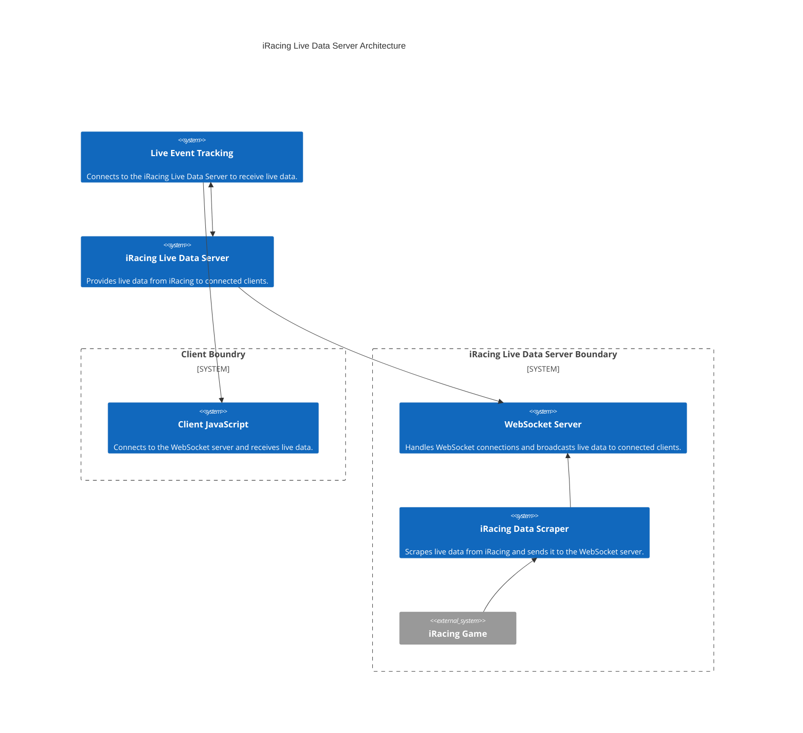

# iRacing Live Data Server
## Objective
Provide a live data server for iRacing that can be used to retrieve real-time data from the game.
Data will be broadcasted over a WebSocket connection unsolicitedly to the connected clients.

  
Features

  <ul>
    <li>Real-Time Lap Time Collection</li>
        <ul>
            <li>Current Lap Number</li>
            <li>Last Lap Time</li>
            <li>Sector Times</li>
            <li>Optimums for Lap and Sector Times</li>
            <li>Best Lap Time</li>
            <li>Best Lap Number</li>
        </ul>
    <li>Reset Session Stats on Command</li>
(reset command sent when Live Event Tracking has the Next Driver clickd and at the start of event)
        <ul>
            <li>Reset All Session Stats</li>
        </ul>
    <li>Updates Broadcasted to connected clients at every sector and lap update</li>
  </ul>

  
Libraries

        
* websockets.asyncio.server
  * Use to create a WebSocket server to handle connections from Live Event Tracking.
* pyirsdk
  * Use to connect to the iRacing simulation and receive live data.
* pyautogui
  * Use to control the mouse and keyboard to simulate driver actions like going back to the pits.

  
Architecture

## Definitions
* iRacing Live Data Server "IRLDS" - A server that provides live data from iRacing to other applications.
* WebSocket Server - A server that provides a bi-directional communication channel between the client and server.
* Live Event Tracking "LET" - A web application that displays real-time data from iRacing.
* iRacing Data Scraper - A server that scrapes data from iRacing and sends it to the WebSocket Server.
* iRacing Game - The game that provides the live data to the iRacing Live Data Server.

  
Use Workflows

### Starting Event Tracking
* Start iRacing and Test Drive simulator
* Start the iRacing Live Data Server "IRLDS"
  * Start the WebSocket Server
  * Start the iRacing Data Scraper
* Open Live Event Tracking (in browser) "LET"
  * Connect to WebSocket Server
* Start Event Tracking (user clicked button in browser)
  * Send a reset all session command to iRacing Live Data Server
  * First Driver is set and data collection will be attributed to that driver thus starting the first driver's Time Trial
  * Live Event Tracking will now listen to iRacing Live Data Server updates to auto fill data allowing the current
  standings section to be updated in real-time.

### Progression During Event
* Live Event Tracking will continue to listen to iRacing Live Data Server updates to auto fill data allowing the current
  standings section to be updated in real-time.
* Once Designated laps for the current driver are completed, The LET will stop listening to 
iRacing Live Data Server updates. A message will be sent to the IRLDS to attempt to Put the driver back to the pits.
A message will be displayed to the driver indicating that their Time Trial has ended.
* User will click Next Diver to start the next driver's Time Trial
  *  Send a reset all session command to IRLDS
  *  This next driver will be set and data collection will be attributed to that driver thus starting the next driver's
  Time Trial
  * LET will now listen to iRacing Live Data Server updates to auto fill data allowing the current
  standings section to be updated in real-time.

### Stopping Event Tracking
* Stop Event Tracking
  * Stop the WebSocket Server
  * Stop the iRacing Data Scraper

